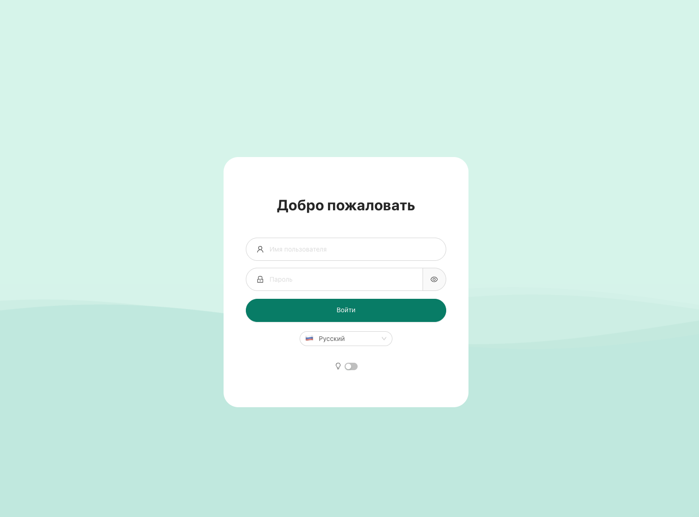

# Установка 3X-UI как под в K3s (Kubernetes)

3x-ui — это симпатичный веб-интерфейс для управления VPN-серверами, такими как WireGuard, Shadowsocks, Xray, V2Ray
и тому подобное. Он позволяет настраивать и мониторить VPN-соединения и клиентов через браузер. Мы будем запускать
его как контейнер (под) внутри K3s кластера на Orange Pi 5.

Мне нужен 3x-ui, для безопасного доступа к домашней сети из любой точки мира, а также для безопасного доступа
к интернету через домашний сервер.

### Создание namespace (не обязательно)

Для удобства организации рекомендую создать отдельное пространство имён (`namespace`) для 3x-ui. Пространство имен --
это способ организовать ресурсы в кластере. Оно работает как виртуальная "папка", которая помогает разделять 
(изолировать) и управлять объектами, такими как поды, сервисы, конфигурации и т.д. Объекты в одном _namespace_ не видят
объекты из другого namespace (если не настроено обратное), что помогает избежать путаницы. Несколько приложений
с одинаковыми именами могут без проблем существовать в разных пространствах имен. Кроме того, можно настроить
права доступа (RBAC) отдельно для каждого namespace. 

Выполним в терминале:
```bash
sudo kubectl create namespace x-ui
```

Проверим, что пространство имён создано:
```bash
kubectl get namespaces
```

Увидим x-ui в списке:
```text
NAME              STATUS   AGE
...               ...      ...
...               ...      ...
x-ui              Active   6s
```

## Простое развёртывание 3X-UI в поде

Cоздадим манифест развертывания пода (этого YAML-файл с инструкциями для K3s, что и как запустить). Мы будем
использовать SQLite как внутреннюю базу данных 3x-ui, и пока эта бызы будет храниться внутри пода. Позже сможем
переключиться на `Longhorn` (опционально).

Создадим `deployment.yaml` в каталоге `~/k3s/vpn/x-ui/` (см. [структуру каталогов для хранения конфигураций и манифестов](k3s-shadowsocks-client.md)
принятую в моем проекте):
```bash
mkdir -p ~/k3s/vpn/x-ui
nano ~/k3s/vpn/x-ui/deployment.yaml
```

Вставим в него следующий код:
```yaml
apiVersion: apps/v1
kind: Deployment
metadata:
  name: x-ui        # имя развертывания (имя пода)
  namespace: x-ui   # пространство имён, в котором будет создан под
spec:
  replicas: 1
  selector:
    matchLabels:
      app: x-ui
  template:
    metadata:
      labels:
        app: x-ui
    spec:
      hostNetwork: true   # использовать сетевой стек хоста
      containers:
      - name: x-ui        # имя контейнера
        image: ghcr.io/mhsanaei/3x-ui:latest
        # image: enwaiax/x-ui:latest    # альтернативный облегчённый: меньше способов шифрования и китайский интерфейс
```
В этом манифесте примечательно следующее:
- `hostNetwork: true` — позволяет контейнеру использовать сетевой стек хоста и значит работать
  с сетевыми интерфейсами и портами хоста напрямую. Это полезно для приложений, которые требуют прямого доступа
  к сети, например, VPN-серверы.
- `spec.replicas: 1` — количество реплик (экземпляров) пода, которые будут запущены. В данном случае -- оин под.
- `spec.selector` —  селектор, который используется для выбора подов, которые будут управляться этим
  развертыванием. Он определяет, какие поды будут обновлены или удалены при изменении конфигурации развертывания.
- `matchLabels` —  метки, которые должны совпадать с метками подов, чтобы они были выбраны селектором.
  В данном случае мы используем метку `app: x-ui`, чтобы выбрать поды, которые относятся к приложению x-ui.


Применим манифест:
```bash
sudo kubectl apply -f ~/k3s/vpn/x-ui/deployment.yaml
```

Проверим, что под запустился:
```bash
sudo k3s kubectl get pods -n x-ui -o wide
```

Увидим что-то вроде:
```text
NAME                   READY   STATUS    RESTARTS   AGE   IP           NODE         NOMINATED NODE   READINESS GATES
x-ui-bb97f6894-h7zj8   1/1     Running   0          11s   10.42.1.50   opi5plus-3   <none>           <none>

Видим, что нода на которой запустился 3x-ui это `opi5plus-3`, а имя пода `x-ui-bb97f6894-h7zj8`. Проверим логи пода,
используя его имя:
```bash
sudo kubectl logs -n x-ui x-ui-bb97f6894-h7zj8
```

Увидим что-то вроде:
```text
Server ready
(0x291e4e8,0x40001657b0)
2025/03/28 13:28:34 Starting x-ui 2.5.6
(0x291e4e8,0x40001658e0)
INFO - Web server running HTTP on [::]:2053
INFO - XRAY: infra/conf/serial: Reading config: &{Name:bin/config.json Format:json}
WARNING - XRAY: core: Xray 25.3.6 started
```

Теперь мы знаем порт, на котором работает 3x-ui (`2053`), и значит можем получить доступ к веб-интерфейсу через браузер
по адресу `http://opi5plus-3:2053` или `http://<IP_адрес_вашего_узла>:2053`.



После первого логирования (по умолчанию логин и пароль `admin`/`admin`) можно настаивать VPN-подключения, создавать
пользователей, менять логин и пароль на вход и т.д. Веб-интерфейс 3x-ui интуитивно понятен, так что разбираться
не составит труда.

## Развертывание Kubernetes пода 3x-ui с постоянным хранилищем (PVC)

Есть, конечно, у 3x-ui под k3s минусы. В частности, внутри пода (`sudo kubectl exec -it -n x-ui x-ui-... -- /bin/sh`)
не будет работать командный интерфейс 3x-ui (`x-ui admin`). Поды k3s работают на **Alpine**, а там некоторые команды
отличаются (например, нет `bash`, а только `ash`). Но web-панель работает как положено, и всё управление удобнее
делать через веб-интерфейс, так что лезть в консоль подов не обязательно.

Но есть ещё другой минус, более критичный. При рестарте пода, все настройки будут сброшены, так как они хранятся
во внутреннем хранилище пода, а при остановке пода хранилище удаляется.

Чтобы этого избежать нужно использовать постоянное хранилище (Persistent Volume). Для его работы требуется установить
`Longhorn` (или другой менеджер хранилищ). K3s поддерживает `Longhorn` из коробки, так как в операционной системе на
Orange Pi 5 нет поддержки `iSCSI`, включение его потребует компиляции ядра (если вы этого еще не сделали, [смотрите
инструкцию](../raspberry-and-orange-pi/opi5plus-rebuilding-linux-kernel-for-iscsi.md).

Если `Longhorn` уже установлен, создадим не его базе постоянное хранилище для -- _PersistentVolumeClaim_ (**PVC**).
Манифест PVC создадим в каталоге `~/k3s/vpn/x-ui/`, рядом с `deployment.yaml`:
```bash
nano ~/k3s/vpn/x-ui/pvc-db.yaml
```

Вставим в него следующий код:
```yaml
apiVersion: v1
kind: PersistentVolumeClaim
metadata:
  name: x-ui-db-pvc
  namespace: x-ui
spec:
  storageClassName: longhorn  # Указываем Longhorn как класс хранилища
  accessModes:
    - ReadWriteOnce           # Доступ для чтения и записи одним подом
  resources:
    requests:
      storage: 512Mi         # Запрашиваемое хранилище, размер можно увеличить, если нужно
```

Обратите внимание:
- `metadata.name` и `metadata.namespace` — имя хранилища (и это имя мы должны использовать в манифесте
  развертывания пода, чтобы указать, какое хранилище использовать) и пространство имён, в котором оно будет создано.
- `spec.storageClassName` — класс хранилища, который будет использоваться для создания постоянного хранилища.
  В данном случае -- `longhorn`.
- `spec.accessModes` — режим доступа к хранилищу. `ReadWriteOnce` означает, что хранилище может быть смонтировано
  только одним подом для чтения и записи. У нас один под и база на SQLite, так что этого достаточно.
- `spec.resources.requests.storage` —  запрашиваемый размер хранилища. Мы запрашиваем 1 ГБ и не означает, что 
  хранилище будет занимать 1 ГБ на диске. Это предельный размер, который сможет занять хранилище.
  
Применим pvc-манифест:
```bash
sudo kubectl apply -f ~/k3s/vpn/x-ui/pvc-db.yaml
```

После этого Longhorn создаст том, который будет привязан к этому PVC.

Теперь нам нужно изменить манифест развертывания пода, и подключить к нему созданный PVC. Теперь наш
`~/k3s/vpn/x-ui/deployment.yaml` будет выглядеть так:
```yaml
apiVersion: apps/v1
kind: Deployment
metadata:
  name: x-ui
  namespace: x-ui
spec:
  replicas: 1
  selector:
    matchLabels:
      app: x-ui
  template:
    metadata:
      labels:
        app: x-ui
    spec:
      hostNetwork: true
      containers:
      - name: x-ui
        image: ghcr.io/mhsanaei/3x-ui:latest
        # image: enwaiax/x-ui:latest    # альтернативный облегчённый: меньше способов шифрования и китайский интерфейс
        volumeMounts:
        - name: db-storage      # Имя тома, в который будет смонтирован...
          mountPath: /etc/x-ui  # ...в путь к базе данных внутри контейнера
      volumes:
      - name: db-storage          # Имя тома, которое...
        persistentVolumeClaim:    # ...должно быть постоянным хранилищем
          claimName: x-ui-db-pvc  # ...и размещаться в PVC с именем 'x-ui-db-pvc'
```

Применим обновлённый манифест:
```bash
sudo kubectl apply -f ~/k3s/vpn/x-ui/deployment.yaml
```

Под перезапустится, и теперь база данных будет храниться в постоянном хранилище Longhorn. При перезапуске пода или его
"переезде" на другой узел, база данных останется доступной и не потеряется. Следует отметить, что при сбое узла 
процесс перемещения пода занимает некоторое время. В кластере на Orange Pi 5, где проверки связности не очень
агрессивные, это может занять до 5 минут. В общем, это нормально.

## Единая точка входа VPN-соединений через под 3x-ui

Под с 3x-ui может быть запущен k3s на произвольном узле, и может быть произвольно перемещён в кластере на другой узел.
Таким образом, если мы хотим предоставить доступ к VPN-соединениям из интернета, нам нужно настроить доступ через
единый IP-адрес. Это можно сделать несколькими способами.

### Доступ через VIP (виртуальный IP) c перенаправлял трафика через Keepalived на узел с подом с 3x-ui

При [развертывании k3s](../raspberry-and-orange-pi/k3s.md) на Orange Pi 5 Plus мы уже настраивали Keepalived. Теперь
надо настроить его так, чтобы узел с подом 3x-ui получал больший приоритет в Keepalived, и тогда виртуальный IP
будет получать трафик с этого узла.

**Лучшим решением будет динамическая настройка приоритета в Keepalived.**

Лучший способ — настроить так, чтобы приоритет Keepalived ноды автоматически повышался, если под 3x-ui запущен на ней.
Это можно сделать с помощью механизма `track_script`, который будет проверять наличие пода и динамически менять
приоритет. Такой подход сохранит текущую работу K3s API и [подов Shadowsocks](k3s-shadowsocks-client.md), добавив
поддержку 3x-ui.

Создадим проверочный скрипт (на каждом узле), который будет проверять наличие пода 3x-ui. Скрипт будет
расположен в `~/scripts/check_xui.sh`:
```bash
mkdir -p ~/scripts
nano ~/scripts/check_xui.sh
```

И вставим в него следующий код (на каждой ноде):
```bash
#!/usr/bin/bash
NODE_NAME=$(hostname)  # Получаем имя текущей ноды
POD_NAME=$(kubectl get pods -n x-ui -o jsonpath="{.items[?(@.spec.nodeName=='$NODE_NAME')].metadata.name}")
if [ -n "$POD_NAME" ]; then
    exit 0  # Под есть на этой ноде
else
    exit 1  # Пода нет
fi
```

Скрипт использует `kubectl`, чтобы проверить, есть ли под `3x-ui` в _namespace_ `x-ui` на текущей ноде. Использование 
`sudo` не требуется, так как скрипт будет запускаться `keepalived`, который работает от `root`.
Убедись, что kubectl доступен на всех нодах и настроен для работы с кластером (например, через kubeconfig).

Сделаем скрипт исполняемым (на каждой ноде):
```bash
sudo chmod +x ~/scripts/check_xui.sh
```

Обновим конфиг `reepalived`, добавив `vrrp_script` и привязку к нему через `track_script`. Теперь мы переведем все
ноды в **BACKUP** (чтобы избежать конфликтов), а приоритет будет динамически меняться в зависимости от наличия пода.

На перовой мастер-ноде:
```bash
sudo nano /etc/keepalived/keepalived.conf
```

И теперь там будет вот такой конфиг (не забудь указать правильное имя пользователя `<user>` в пути к скрипту):
```pycon
vrrp_script check_xui {
    script "/home/<user>/scripts/check_xui.sh"
    interval 2          # Проверять каждые 2 секунды
    weight 50           # Добавить 50 к приоритету, если под есть
}

vrrp_instance VI_1 {
    # state MASTER
    state BACKUP        # Все ноды стартуют как BACKUP
    interface enP4p65s0
    virtual_router_id 51
    priority 100        # Базовый приоритет
    advert_int 1
    unicast_src_ip 192.168.1.26
    unicast_peer {
        192.168.1.27
        192.168.1.28
    }
    virtual_ipaddress {
        192.168.1.200
    }
    track_script {
        check_xui       # Привязка к скрипту
    }
}
```

Перезапустим Keepalived:
```bash
sudo service keepalived restart
```

Аналогичным образом настроим конфиги на других узлах (добавить блок `vrrp_script` сверху, и добавить `track_script` в
`vrrp_instance`). Не забудь указать проверить `unicast_src_ip` для каждой ноды и перезапустить Keepalived на всех узлах.

Теперь на каждой ноде cкрипт `~/scripts/check_xui.sh` проверяет наличие пода `x-ui` каждые 2 секунды. Если под есть,
Keepalived добавляет 50 к базовому приоритету ноды (например, 100 → 150). Если пода нет, приоритет остаётся базовым
(100, 90 или 80). Нода с наивысшим приоритетом становится MASTER и получает виртуальный IP. Таким образом, VIP всегда
будет указывать на ноду с подом 3x-ui.

Теперь панель 3x-ui будет доступна с виртуального IP (192.168.1.200). Все VPN-соединения будут работать через него.
Так что если на домашнем роутере настроить перенаправление портов (для 2053-порта веб-панели 3x-ui, и портов которые
будем выбирать для VPN-соединений), то можно будет подключаться к 3x-ui и VPN-соединениям из любой точки мира.


### Доступ через Ingress Controller по имени домена (http).

Сейчас web-панель 3x-ui доступна через VIP по порту `2053` по http. _В принципе, так можно и оставить_. Но если мы хотим
иметь доступ по https, да еще чтобы это работало через доменное имя, и чтобы k3s автоматически получал и обновлял 
сертификаты, то можно использовать Ingress-контроллер. Он будет брать трафик с порта VIP, по порту `2055`, через
балансировщик svclb-traefik направлять его на Ingress-контроллер Traefik и перенаправлять его на под с 3x-ui (тоже
через VIP но уже по порту `2053`). Дополнительно, есть [заметка про настройку Traefik в качестве прокси](k3s-proxy.md).

#### Манифест для Ingress-контроллера Traefik

По умолчанию Ingress-контроллер Traefik в k3s слушает на портах 80 и 443 (HTTP и HTTPS) и перенаправляет трафик
на соответствующие поды. В моем случае порты 80 и 443 на моем роутере уже перенаправляются на другой хост.
В будущем я это, возможно, изменю, и сейчас я не могу перенаправить эти порты на VIP. Поэтому мне нужно настроить
Traefik так, чтобы он слушал http/https на другом порту (например, 2055, и порт, обратите внимание, стандартный
443-порт от продолжит слушать как и раньше) и перенаправлял трафик на под с 3x-ui (это только для http/https, то есть
для доступа в веб-интерфейсу 3x-ui, а не для VPN-соединений). Этот манифест задаёт глобальную конфигурацию Traefik
для всего кластера, а не только к 3x-ui, и потому лучше положить его в "общую" папку для Traefik, например:
`~/k3s/traefik/traefik-config.yaml`:

```bash
mkdir -p ~/k3s/traefik
nano ~/k3s/traefik/traefik-config.yaml
```

И вставим в него следующий код:
```yaml
apiVersion: helm.cattle.io/v1
kind: HelmChartConfig
metadata:
  name: traefik
  namespace: kube-system
spec:
  valuesContent: |-
    additionalArguments:
      - --entrypoints.web-custom.address=:2055    # Слушаем HTTP на 2055
      - --log.level=DEBUG
```
Что тут происходит: Для изменения настройки Traefik, создаётся HelmChartConfig (этот такой аналог пакетного менеджера
для Kubernetes, который позволяет управлять приложениями и сервисами в кластере). Этот манифест указывает Traefik,
в пространство имён `kube-system`, а аргумент `--entrypoints.web-custom.address=:2055` в конфигурацию -- инструкция:
_Слушай порт 2055 и назови эту точку входа **web-custom**_). После применения Traefik начнёт принимать запросы на порту
2055. Поскольку мой роутер пробрасывает 2055 на VIP-адрес (тоже 2055 порт), Traefik на ноде с VIP увидит этот трафик.

Применим манифест:
```bash
sudo kubectl apply -f ~/k3s/traefik/traefik-config.yaml
```

Теперь Traefik будет слушать http еще и на порту 2055.

#### Манифест для маршрутизации трафика на под с 3x-ui через Ingress-контроллер

Теперь нужно сказать Traefik, что запросы на домен `v.home.cube2.ru` через порт `2055` — это HTTP, и их надо
перенаправить на порт 2053, где работает 3x-ui. Для этого в каталоге с манифестами 3x-ui `~/k3s/vpn/x-ui/`
(ведь это касается подa с 3x-ui) создадим манифест IngressRoute:
```bash
nano ~/k3s/vpn/x-ui/ingressroute.yaml
```

И вставим в него следующий код (не забудь указать свой домен):
```yaml
apiVersion: traefik.containo.us/v1alpha1
kind: IngressRoute
metadata:
  name: x-ui-ingress
  namespace: x-ui
spec:
  entryPoints:
    - web-custom  # ендпоинт, который "слушает" порт 2055
  routes:
    - match: Host("v.home.cube2.ru")
      kind: Rule
      services:
        - name: x-ui-external   # имя сервиса, на который будет перенаправлен трафик
          port: 2053            # порт, на который будет перенаправлен трафик
```

Что тут происходит? Мы создаём объект `IngressRoute`, который определяет маршрут для входящего трафика. Параметры:
- `kind` — тип объекта, который мы создаём. В данном случае это `IngressRoute`, который используется для
  маршрутизации трафика в Traefik.
- `metadata` — метаданные объекта, такие как имя и пространство имён. Мы указываем имя `x-ui-ingress` и
  пространство имён `x-ui`, в котором будет создан объект (то же пространство, что и у пода с 3x-ui).
- `entryPoints` — точка входа, которая будет использоваться для маршрутизации трафика. В данном случае это `web-custom`,
  который мы настроили в предыдущем шаге.
- `routes` — определяет правила маршрутизации. В данном случае мы указываем, что если запрос приходит на домен
  `v.home.cube2.ru` (`match` — условие, которое должно быть выполнено для маршрутизации), то он будет перенаправлен
  на сервис `x-ui-external` (который мы создадим ниже) на порт `2053`.

Теперь создадим сервис `x-ui-external`, который будет использоваться для маршрутизации трафика на под с 3x-ui.

Создадим манифест сервиса в каталоге `~/k3s/vpn/x-ui/`:
```bash
nano ~/k3s/vpn/x-ui/x-ui-service.yaml
```

И вставим в него следующий код:
```yaml
# Service для 3x-ui с hostNetwork: true, использующего VIP 192.168.1.200
apiVersion: v1
kind: Service           # Тип объекта, который мы создаём. В данном случае это Service
metadata:
  name: x-ui-external   
  namespace: x-ui       
spec:
  ports:
    - port: 2053        
      targetPort: 2053  
      protocol: TCP
---
# Endpoints указывает на VIP, так как под не в сетевом пространстве Kubernetes
apiVersion: v1
kind: Endpoints         # Тип объекта, который мы создаём. В данном случае это Endpoints
metadata:
  name: x-ui-external   
  namespace: x-ui       
subsets:
  - addresses:
      - ip: 192.168.1.200   # IP-адрес (VIP), на который будет перенаправлен трафик
    ports:
      - port: 2053
        protocol: TCP
```

Что тут происходит? Мы создаём два объекта: `Service` и `Endpoints`. `Service` — это абстракция, которая предоставляет
единый IP-адрес и DNS-имя для доступа к группе подов. `Endpoints` — это объект, который указывает конечные точки
для перенаправления трафика. В нашем случае это VIP:2053, так как под 3x-ui использует `hostNetwork: true`
и недоступен через внутренние IP Kubernetes. Но обычно `Endpoints` указывают на имена подов, на которые отправляется
трафик. 

Для `Service` мы указываем:
- `kind` — тип объекта, который мы создаём. В данном случае это `Service`.
- `metadata` — метаданные объекта, такие как имя и пространство имён. Мы указываем имя `x-ui-external` и
  пространство имён `x-ui`, в котором будет создан объект (то же пространство, что и у пода с 3x-ui).
- `spec` — спецификация объекта, которая определяет его поведение. Мы указываем, что сервис будет слушать внешний трафик
  на порту `2053` и перенаправлять на тот же порт внутри кластера.
- `ports` — определяет порты, на которых будет слушать сервис. Мы указываем, что сервис будет слушать
  на порту `2053` и перенаправлять трафик на тот же порт внутри кластера, и будем использоваться TCP.

Для `Endpoints` мы указываем:
- `kind` — тип объекта, который мы создаём. В данном случае это `Endpoints`.
- `metadata` — метаданные объекта, такие как имя и пространство имён. Мы указываем имя `x-ui-external` (то же,
  что и у сервиса) и пространство имён `x-ui` (то же, что и у пода с 3x-ui).
- `subsets` — подмножество конечных точек, которые будут использоваться для маршрутизации трафика. Мы указываем, что
  в подмножестве есть одна конечная точка с IP 192.168.1.200 и портом 2053 (TCP). 

Применим манифесты:
```bash
sudo kubectl apply -f ~/k3s/vpn/x-ui/ingressroute.yaml
sudo kubectl apply -f ~/k3s/vpn/x-ui/x-ui-service.yaml
```

Перезагрузим Traefik, чтобы он увидел изменения:
```bash
kubectl rollout restart deployment traefik -n kube-system
```

Или для надёжности вовсе удалим поды с traefik и svclb-traefik, тогда они должны создастся заново, и гарантированно
примут новые настройки:
```bash
kubectl delete pod -n kube-system -l app.kubernetes.io/name=traefik
kubectl delete pod -n kube-system -l svccontroller.k3s.cattle.io/svcname=traefik
```

Проверим, что поды создались и запустились:
```bash
sudo kubectl get pods -n kube-system -o wide | grep traefik
```

Увидим что-то вроде (поды стартовали недавно):
```text
helm-install-traefik-c4vlp                      0/1     Completed   0             148m   10.42.0.84   opi5plus-2   <none>           <none>
svclb-traefik-4f8c2580-8pfdg                    4/4     Running     0             4m     10.42.2.62   opi5plus-1   <none>           <none>
svclb-traefik-4f8c2580-9tldj                    4/4     Running     0             4m     10.42.1.93   opi5plus-3   <none>           <none>
svclb-traefik-4f8c2580-pmbqj                    4/4     Running     0             4m     10.42.0.83   opi5plus-2   <none>           <none>
traefik-5db7d4fd45-45gj6                        1/1     Running     0             4m     10.42.0.82   opi5plus-2   <none>           <none>
```

Проверим, что сервисы создались и запустились:
```bash
sudo kubectl get svc -n kube-system -o wide | grep traefik
```

Увидим что-то вроде (есть обработка через порт 2055:ххххх):  
```text
traefik                LoadBalancer   10.43.164.48    192.168.1.26,192.168.1.27,192.168.1.28   80:31941/TCP,443:30329/TCP,9000:32185/TCP,2055:32627/TCP   53d   app.kubernetes.io/instance=traefik-kube-system,app.kubernetes.io/name=traefik
```

Проверим, что созданный сервис `x-ui-external` доступен:
```bash
sudo kubectl get svc -n x-ui -o wide
```

Увидим что-то вроде (сервис создан и слушает на порту 2053):
```text
NAME            TYPE        CLUSTER-IP     EXTERNAL-IP   PORT(S)    AGE   SELECTOR
x-ui-external   ClusterIP   10.43.73.106   <none>        2053/TCP   2h    <none>
```

Проверим, что созданный IngressRoute доступен:
```bash
sudo kubectl get ingressroutes -n x-ui -o wide
```

Увидим что-то вроде (IngressRoute создан):
```text
NAME           AGE
x-ui-ingress   14h
```

Проверим логи Traefik (не зря же мы включали отладку в манифесте)
```bash
kubectl get pods -n kube-system | grep traefik
sudo kubectl logs -n kube-system traefik-<hash> --since=5m
```
Ищем: `"web-custom": {"address": ":2055"}` и маршрут `x-ui-x-ui-ingress` с `Host("v.home.cube2.ru")`,

И наконец, проверим, что под с 3x-ui доступен по нашему доменному на порту 2055 через VIP-адрес (возможно, придется
сделать запись в `/etc/hosts`, если ваш роутер не может разрешить внешний домен внутрь домашней сети, и поставить
в соответствие домен и VIP):
```bash
curl -v http://v.home.cube2.ru:2055
```

**Все заработало**, мы видим, что запросы на домен `v.home.cube2.ru` через порт `2055` перенаправляются на под с 3x-ui

Если не получилось, то можно дополнительно проверить, что с сервисом `traefik` всё в порядке. Посмотрим его текущие
настройки:
```bash
sudo  kubectl get service -n kube-system traefik -o yaml
```

Мы должны увидеть в блоке `spec:ports` что-то типа:
```yaml
  - name: web-custom
    nodePort: тут-будет-номер-порта-внутри-балансировщика
    port: 2055
    protocol: TCP
    targetPort: 2055
```

Если блока нет, добавьте его через редактор (по умолчанию откроется `vim`, используйте `:wq` для сохранения и выхода):
```bash
sudo kubectl edit service -n kube-system traefik -o yaml
```

Найти в `spec:ports` блок:
```yaml
  - name: web                                                              
    nodePort: 31941                                                                       
    port: 80                          
    protocol: TCP        
    targetPort: web      
  - name: websecure      
    nodePort: 30329                                
    port: 443                                      
    protocol: TCP                                  
    targetPort: websecure  
```

И добавить под ним новый блок:
```yaml
  - name: web-custom
    port: 2055
    protocol: TCP
    targetPort: 2055
```

После сохранения изменений и выхода из редактора, сервис будет обновлён автоматически. Можно проверить, что ему присвоен
новый номер порта внутри балансировщика (см. выше) и возможно все заработает. Но скорее всего придется удалить манифесты
`ingressroute.yaml`, `x-ui-service.yaml` и все настраивать заново, проверять логи и т.д.


### Доступ через Ingress Controller c https и перенаправлением трафика на узел с подом с 3x-ui

Установим Cert-Manager для автоматического получения сертификатов Let's Encrypt. Это позволит нам использовать
HTTPS для доступа к 3x-ui (и другим подам). Cert-Manager автоматически обновляет сертификаты, когда они истекают.
```bash
sudo kubectl apply -f https://github.com/cert-manager/cert-manager/releases/download/v1.13.1/cert-manager.yaml
```

В результате у нас появится три новых пода в пространстве имён `cert-manager`:
```bash
sudo k3s kubectl get pods -n cert-manager -o wide
```

Увидим что-то вроде:
```text
NAME                                       READY   STATUS    RESTARTS   AGE     IP           NODE         NOMINATED NODE   READINESS GATES
cert-manager-64478b89d5-p4msl              1/1     Running   0          8m36s   10.42.1.55   opi5plus-3   <none>           <none>
cert-manager-cainjector-65559df4ff-t7rj4   1/1     Running   0          8m36s   10.42.1.54   opi5plus-3   <none>           <none>
cert-manager-webhook-544c988c49-zxdxc      1/1     Running   0          8m36s   10.42.1.56   opi5plus-3   <none>           <none>
```

Cert-Manager состоит из трёх основных компонентов, каждый из которых запускается в своём поде:
* `cert-manager` -- основной контроллер. Он следит за ресурсами вроде Certificate и Issuer, запрашивает сертификаты
   у провайдеров (например, Let’s Encrypt) и обновляет их при необходимости.
* `cert-manager-cainjector` -- внедряет CA (Certificate Authority) в вебхуки и другие ресурсы Kubernetes, чтобы
  они могли доверять сертификатам, выданным Cert-Manager.
* `cert-manager-webhook` -- отвечает за валидацию и мутацию запросов на создание или обновление ресурсов, связанных
  с сертификатами. Он проверяет их на соответствие правилам.

#### Манифест для ClusterIssuer

Создадим манифест ClusterIssuer (эмитент кластера) для Cert-Manager и относится ко всему кластеру. В нем описываются
правила для получения сертификатов от внешнего поставщика (в нашем случае Let's Encrypt) и укажем твм адрес сервера
ACME, email для уведомлений, способы подтверждения владения доменом (например, через HTTP-01 или DNS-01).

```bash
mkdir ~/k3s/cert-manager
nano ~/k3s/cert-manager/clusterissuer.yaml
```

И вставим в него следующий код (не забудь указать свой email):
```yaml
piVersion: cert-manager.io/v1
kind: ClusterIssuer
metadata:
  name: letsencrypt-prod
spec:
  acme:
    server: https://acme-v02.api.letsencrypt.org/directory
    email: ваш@емейл.где-то
    privateKeySecretRef:
      name: letsencrypt-prod
    solvers:
    - http01:
        ingress:
          class: traefik  # Ingress-контроллер, например, traefik
```

Применим манифест, чтобы cert-manager принял конфигурацию:
```bash
sudo kubectl apply -f ~/k3s/cert-manager/clusterissuer.yaml 
```

Это будет работать для всего кластера и для всех подов (текущих и будущих). Cert-Manager будет автоматически
запрашивать и обновлять сертификаты. Let's Encrypt при проверке прав владения доменом посредством правила HTTP-01 
использует http (порт 80) и нужно настроить в роутере перенаправление трафика на кластер (лучше через VIP) для этого
порта.


