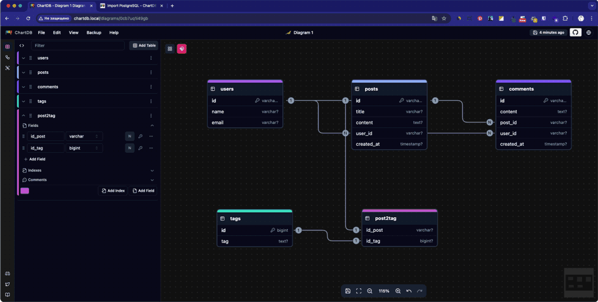

# Под с ChartDB

ChatBD ([chartdb.io](https://chartdb.io/)) - это визуальный редактор структуры базы данных и инструмент проектирования
схем (ER-диаграмм), мини-конструктор для работы с локальной псевдо-БД. Все это доступно в веб-интерфейсе. Пока ChatBD
не позволяет подключаться к реальным базам данных, но в будущем планируется поддержка. Зато в нее можно импортировать
схемы рабочих баз данных из PostgreSQL, MySQL, MariaDB, SQLite, MSSQL, ClickHouse и CockroachDB. Так же поддерживается
экспорт из JSON и DBML. Импорт готовых схем возможен в любую из поддерживаемых СУБД (плюс JSON и DBML).

Можно работать с таблицами, колонками, индексами, ключами... но в документации прямо заявлено:
> «Самостоятельная версия не поддерживает удаленные подключения к базе данных или аутентификацию.
> Для полной функциональности используйте chartdb.io».

Но самое печальное, в нем нет никаких инструментов для создания запросов.

_Из интересных фишек ChatDB -- к нему можно подключить LLM (через API OpenAI или локальный Ollama) и тогда он,
похоже, сможет генерировать SQL-запросы по текстовым описаниям. Но это я пока пока не проверил (ждите обновления этой
инструкции)._

Манифест для развертывания пода с ChartDB в k3s, который предоставляет веб-интерфейс по адресу `http://chartdb.local`:
```yaml
# ~/k3s/chartdb/chartdb.yaml
# Все манифесты для ChartDB

# 1. Манифест создания пространства имён `chartdb`. Если оно уже есть — kubectl apply ничего не изменит
apiVersion: v1
kind: Namespace
metadata:
  name: chartdb

---
# 2. Манифест PVC (Longhorn) -- том в блочном хранилище, в котором будут храниться данные ChartDB.
apiVersion: v1
kind: PersistentVolumeClaim
metadata:
  name: chartdb-data
  namespace: chartdb
spec:
  accessModes:
    - ReadWriteOnce
  storageClassName: longhorn
  resources:
    requests:
      storage: 320Mi    # Более чем достаточно для хранения схем и данных ChartDB, даже 150Mi хватит

---
# 3. Deployment: развёртывание ChartDB
apiVersion: apps/v1
kind: Deployment
metadata:
  name: chartdb
  namespace: chartdb
spec:
  replicas: 1
  selector:
    matchLabels:
      app: chartdb
  template:
    metadata:
      labels:
        app: chartdb
    spec:
      containers:
      - name: chartdb
        image: ghcr.io/chartdb/chartdb:latest
        ports:
          - containerPort: 80
        env:
          - name: TZ                    # Часовой пояс, который будет в поде
            value: Europe/Moscow
        resources:
          requests:
            memory: "128Mi"
            cpu: "100m"
          limits:
            memory: "512Mi"
            cpu: "500m"    
        volumeMounts:                     # Монтируем том:
          - name: chartdb-storage         # ... имя PVC-тома
            mountPath: /data              # ...путь внутри контейнера, куда будет смонтирован PVC-том
      volumes:                        # Используемые том:
        - name: chartdb-storage       # ... c именем
          persistentVolumeClaim:      # ... PVC (Longhorn)
            claimName: chartdb-data

---
# 4. Service: внутренний доступ к контейнеру ChartDB
apiVersion: v1
kind: Service
metadata:
  name: chartdb
  namespace: chartdb
spec:
  selector:
    app: chartdb
  ports:
    - port: 80
      targetPort: 80
  type: ClusterIP

---
# 5. IngressRoute для Traefik (под твою конфигурацию)
# Это публикует ChartDB по адресу http://chartdb.local (заменить на свой домен)
apiVersion: traefik.io/v1alpha1
kind: IngressRoute
metadata:
  name: chartdb
  namespace: chartdb
spec:
  entryPoints:
    - web              # это должен быть один из entrypoints в Traefik (обычно "web" = порт 80)
  routes:
  - match: Host("chartdb.local")   # доменное имя, по которому будет доступен сервис
    kind: Rule
    services:
    - name: chartdb
      port: 80
```

Применим манифесты командой:
```shell
kubectl apply -f ~/k3s/chartdb/chartdb.yaml
```

После этого ChartDB будет доступен по адресу `http://chartdb.local`. и в нем можно будет создавать и редактировать
схемы, например:


