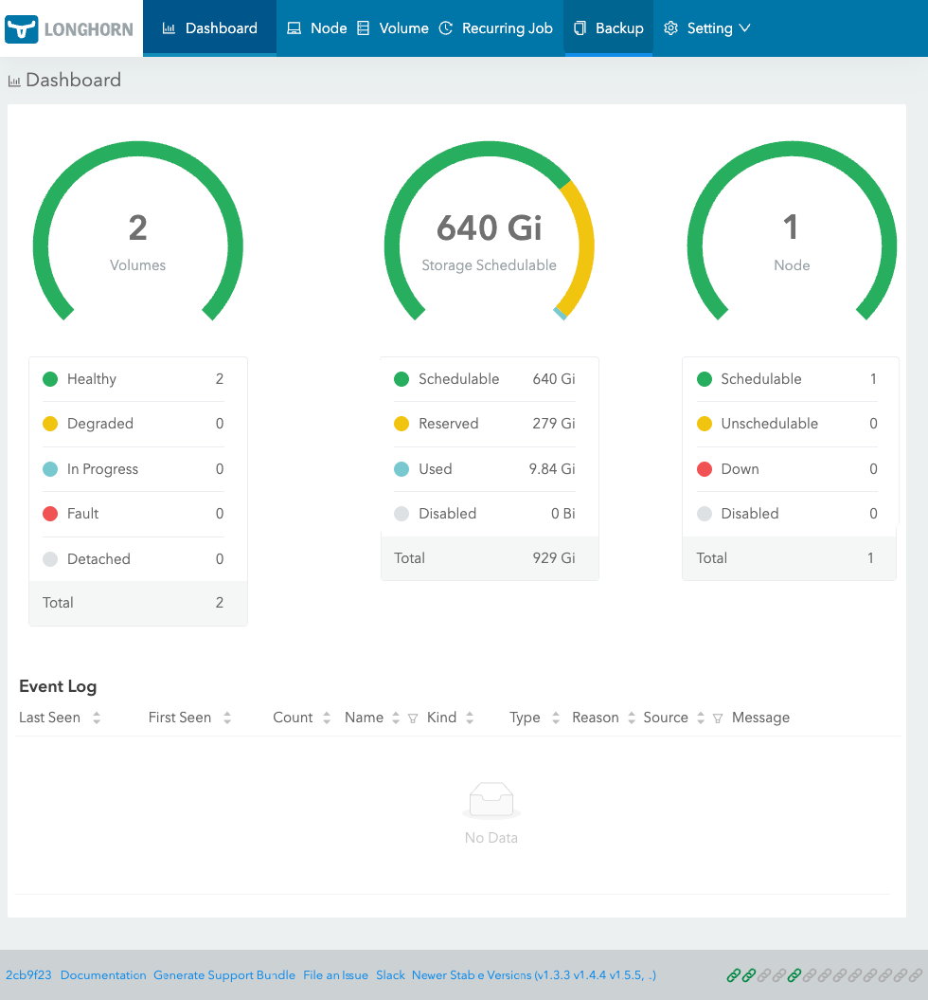

# Настройка доступа к панелям управления Lobghorn и Traefik

В k3s есть несколько панелей управления, которые можно настроить для доступа извне кластера.

# Панель управления блочный хранилищем (Persistent Volume) Longhorn

Панель управления Longhorn позволяет управлять блочными хранилищами (Persistent Volume) в k3s. Полезнейшая вещь!
Через нее можно не только отслеживать работу тома, но и создавать, удалять и изменять PVC-хранилища, и, главное,
делать бэкапы томов и восстанавливать их.

Проверим, поды Longhorn, и в нем есть UI (интерфейс управления):
```shell
kubectl get pod -n longhorn-system
```

Увидим что-то вроде:
```text
NAME                                                READY   STATUS    RESTARTS      AGE 
...
...
longhorn-ui-f7ff9c74-7bbsw                          1/1     Running   2 (26h ago)   21h
longhorn-ui-f7ff9c74-b4svq                          1/1     Running   3 (26h ago)   21h
...
```

Поды longhorn-ui работают -- интерфейс управления Longhorn -- доступен.

Проверим доступные сервисы Longhorn:
```shell
kubectl get svc -n longhorn-system
```

Увидим что-то типа:
```text
NAME                          TYPE        CLUSTER-IP      EXTERNAL-IP   PORT(S)    AGE
longhorn-admission-webhook    ClusterIP   10.43.123.226   <none>        9502/TCP   21h
longhorn-backend              ClusterIP   10.43.226.46    <none>        9500/TCP   21h
longhorn-conversion-webhook   ClusterIP   10.43.243.121   <none>        9501/TCP   21h
longhorn-frontend             ClusterIP   10.43.152.91    <none>        80/TCP     21h
longhorn-recovery-backend     ClusterIP   10.43.205.78    <none>        9503/TCP   21h
```

Как видим, есть сервис `longhorn-frontend` с типом `ClusterIP` (внутренний IP-адрес кластера) и портом 80. Это
и есть интерфейс управления Longhorn. Проверим, что он доступен по этому адресу:
```shell
curl -v http://10.43.152.91
```

Увидим что-то вроде:
```text
*   Trying 10.43.152.91:80...
* Connected to 10.43.152.91 (10.43.152.91) port 80 (#0)
> GET / HTTP/1.1
> Host: 10.43.152.91
> User-Agent: curl/7.81.0
> Accept: */*
> 
* Mark bundle as not supporting multiuse
< HTTP/1.1 200 OK
< Server: nginx/1.21.5
...
...
```

Как видим, Longhorn доступен, и выдает 200 OK.

### Манифес IngressRoute для доступа к панели управления Longhorn

Я настраиваю панель управления Longhorn на доступ по адресу `pvc.local` (достигается через соответствующий DNS-запись
в локальном DNS-сервере или редактированием файла `/etc/hosts`). Создадим IngressRoute-манифест для доступа
к дашборду Longhorn по домену `pvc.local` (или какому вы там сами пожелаете).

```yaml
# IngressRoute-манифест, для доступа к панели управления Longhorn по адресу http://pvc.local
apiVersion: traefik.io/v1alpha1
kind: IngressRoute
metadata:
  name: longhorn-ui             # имя ресурса (пода) 
  namespace: longhorn-system
spec:
  entryPoints:
    - web
  routes:
    - match: Host("pvc.local")  # маршрутизируем запросы с хоста pvc.local
      kind: Rule
      services:
        - name: longhorn-frontend   # целевой сервис
          port: 80
```

Что туту происходит:
* `apiVersion: traefik.io/v1alpha1` — стандартный CRD для Traefik в k3s.
* `kind: IngressRoute` — ресурс Traefik для маршрутизации.
* `metadata`:
  * `name: longhorn-ui` — имя ресурса (пода) longhorn-ui.
  * `namespace: longhorn-system` — в пространстве имен longhorn-system.
* `spec:`
  * `entryPoints: [web]` — используем entryPoint: web (порт 8000, HTTP, но снаружи будет доступен по 80-му порту).
  * `routes:` — маршруты.
    * `match: Host("pvc.local")` — маршрутизируем запросы с хоста `pvc.local`.
    * `kind: Rule` — правило маршрутизации.
    * `services:`
      * `name: longhorn-frontend` — целевой сервис.
      * `port: 80` — порт на котором работает сервис longhorn-frontend.

Применим манифест и проверим, что он применился:
```shell
kubectl apply -f <путь_к_файлу_с_манифестом>
kubectl get ingressroute -n longhorn-system
```

Увидим что-то вроде:
```text
NAME            AGE
longhorn-ui     124m
```

Проверим, что панель управления Longhorn доступна по адресу `pvc.local`:
```shell
curl -v http://pvc.local
```

Увидим что-то вроде:
```text
*   Trying <IP>:80...
* Connected to pvc.local (<IP>) port 80 (#0)
> GET / HTTP/1.1
> Host: pvc.local
> User-Agent: curl/7.81.0
> Accept: */*
> GET / HTTP/1.1
> 
* Mark bundle as not supporting multiuse
< HTTP/1.1 200 OK
< Server: nginx/1.21.5
```

Как видим, Longhorn теперь доступен по адресу `pvc.local` и выдает 200 OK.

Можно открыть в браузере `http://pvc.local` и увидеть панель управления Longhorn:




### Изменение числа реплик Longhorn (не обязательно)

Если у вас всего одна нода, то в панели управления Longhorn вы можете увидеть, что тома находятся в состоянии
`degraded` (деградированное). Это связано с тем, что Longhorn не может создать реплики на других нодах, так как их нет.
Исправить это можно, изменив число глобальное число реплик Longhorn с 3 до 1. Это можно сделать через команду:
```shell
kubectl edit settings.longhorn.io -n longhorn-system default-replica-count
```

Найти и отредактировать:
```yaml
value: "3"
```

После этого уже в панели управления Longhorn можно будет изменить число реплик для каждого тома с 3 до 1 и все тома
будут в состоянии `healthy` (здоровое).

## Панель управления Traefik

Дашборд Traefik позволяет визуализировать маршрутизацию и состояние сервисов. Не так чтоб сильно полезная вещь,
но с ней можно поиграться и к ней есть [https://plugins.traefik.io/plugins](множество плагинов и расширений).

Я настраиваю панель управления Traefik на доступ по адресу `traefik.local` (достигается через соответствующий DNS-запись
в локальном DNS-сервере или редактированием файла `/etc/hosts`).

### Изменение конфигурации Traefik (через Helm)

По умолчанию панель управления Traefik недоступна извне кластера. Чтобы это исправить, нужно создать нужно изменить
конфигурацию Traefik, чтобы проверить, что панель управления включена и разрешить доступ к ней по HTTP. Это можно
сделать через Helm, используя HelmChartConfig. Если у вас уже есть манифест HelmChartConfig для traefik, то просто
добавьте в него в блок `spec: valuesContent: additionalArguments:` дополнительные аргументы: `--api.dashboard=true` и
`--api.insecure=true`.

Если у вас нет HelmChartConfig, то создайте его:
```shell
mkdir -p ~/k3s/traefik
nano ~/k3s/traefik/traefik-helm-config.yaml
```

И вставьте в него следующее содержимое:
```yaml
apiVersion: helm.cattle.io/v1
kind: HelmChartConfig
metadata:
  name: traefik
  namespace: kube-system
spec:
  valuesContent: |
    additionalArguments:
      - --api.dashboard=true    # включает панель управления (dashboard) Traefik (обычно он уже включен)
      - --api.insecure=true     # разрешает доступ к dashboard Traefik по HTTP
```

Применим манифест:
```shell
kubectl apply -f ~/k3s/traefik/traefik-helm-config.yaml
```

Пезезапустим Traefik, чтобы изменения вступили в силу:
```shell
kubectl rollout restart deployment -n kube-system traefik
```

### Создание IngressRoute для доступа к панели управления Traefik с http

Создадим манифест IngressRoute для доступа к панели управления Traefik по домену `traefik.local` (или какому вы там
сами пожелаете):

```yaml
# IngressRoute-манифест, для доступа к панели управления Traefik по адресу http://traefik.local 
apiVersion: traefik.io/v1alpha1
kind: IngressRoute
metadata:
  name: traefik-dashboard
  namespace: kube-system
spec:
  entryPoints:
  - web         
  routes:
  - match: Host("traefik.local") && PathPrefix("/dashboard")   # доступ к панели управления
    kind: Rule
    services:
    - name: api@internal      # имя встроенного в k3s сервиса Traefik для доступа к панели управления
      kind: TraefikService    # тип сервиса
  - match: Host("traefik.local") && PathPrefix("/api")        # доступ к API
    kind: Rule
    services:
    - name: api@internal
      kind: TraefikService
  - match: Host("traefik.local") && Path("/")        # переадресация чтобы не вызывать по полному пути (`/dashboard`)
    kind: Rule
    services:
    - name: api@internal
      kind: TraefikService
```

Применим манифест и проверим, что он применился:
```shell
kubectl get ingressroute -n kube-system
```

Увидим что-то вроде:
```text
NAME                AGE
traefik-dashboard   4m
```

Проверим, что панель управления Traefik доступна по адресу `traefik.local`:
```shell
curl -v http://traefik.local/dashboard/
```

Увидим что-то вроде:
```text
   Trying <IP>:80...
* Connected to traefik.local (<IP>) port 80 (#0)
> GET /dashboard/ HTTP/1.1
> Host: traefik.local
> User-Agent: curl/7.81.0
> Accept: */*
> 
* Mark bundle as not supporting multiuse
< HTTP/1.1 200 OK
< Content-Security-Policy: frame-src 'self' https://traefik.io https://*.traefik.io;
...
...
```

Как видим, статус 200 OK, значит панель доступна и работает.

```shell
curl -v http://traefik.local/
```

Увидим что-то вроде:
```text
   Trying <IP>:80...
* Connected to traefik.local (<IP>) port 80 (#0)
> GET / HTTP/1.1
> Host: traefik.local
> User-Agent: curl/7.81.0
> Accept: */*
> 
* Mark bundle as not supporting multiuse
< HTTP/1.1 302 Found
< Location: /dashboard/
< Date: Sat, 03 May 2025 11:59:19 GMT
< Content-Length: 0
```

Как видим, статус 302 Found, значит переадресация тоже работает.

Откроем в браузере `http://traefik.local/dashboard/` и видим панель управления Traefik:

