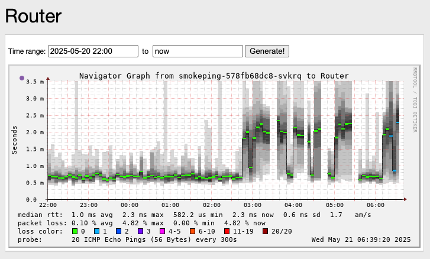

# Контейнер со smokeping в k3s

Полная жопа с домашним интеренетом? А поддержка провайдера, типа МГТС или Ростелеком, отвечает: "Проблем на линии нет,
у нас все работает"? А может быть, вы хотите следить за доступностью и сетевыми задержками в доступности своих серверов
в разных локациях, или в домашней сети?.. Smokeping -- это то, что вам нужно! Не такой громоздкий, как Zabbix,
и не такой сложный в настройке, как Grafana (хотя к Grafana его тоже можно подключить), и главное супер-компактный
и легкий.

И так, все манифесты в одном файле. Только поменяйте в манифесте `smokeping-config` меню, название и IP-адреса
на свои, и укажите на какое доменное имя публикуете веб-панель (у меня --  http://sp.local). Ну и читайте пояснения
и комментарии внутри манифестов:
```yaml
# ~/k3s/smokeping/smokeping.yaml
# Все манифесты для smokeping 

# Манифест создания пространства имён `smokeping`. Если оно уже есть — kubectl apply ничего не изменит (т.е. безопасно.)
apiVersion: v1
kind: Namespace
metadata:
  name: smokeping

---
# Манифест ConfigMap с конфигурацией Targets для smokeping
apiVersion: v1
kind: ConfigMap
metadata:
  name: smokeping-config
  namespace: smokeping
data:
  # Это содержимое файла Targets. Здесь указываем, кого пинговать.
  Targets: |
    *** Targets ***

    probe = FPing

    menu = Top
    title = Network Latency Grapher
    remark = Привет тебе, путник. SmokePing website of Campany.\
             Тут ты узнаешь все о задержках в вашей сети.

    + HOME
    menu = HOME
    title = HOME

    ++ Router
    menu = Router
    title = Router
    alerts = someloss
    host = 192.168.1.1

    ++ NAS
    menu = NAS
    title = NAS
    alerts = someloss
    host = 192.168.1.xxx

    ++ K3S_VIP
    menu = K3S_VIP
    title = K3S_VIP
    alerts = someloss
    host = 192.168.1.xxx
    
    ++ YANDEX_ALISA
    menu = YANDEX_ALISA
    title = YANDEX_ALISA
    alerts = someloss
    host = 192.168.1.xxx


    + INTERNET
    menu = INTERNET
    title = INTERNET

    ++ HOSTING_RU
    menu = Russia
    title = MasterHost_ru
    alerts = someloss
    host = xxx.xxx.xxx.xxx

    ++ HOSTING_EU
    menu = Sweden
    title = xxxxxxx
    alerts = someloss
    host = xxx.xxx.xxx.xxx

    ++ HOSTING_AS
    menu = Tureky
    title = xxxxxxx
    alerts = someloss
    host = xxx.xxx.xxx.xxx


---
# Манифест PVC (Longhorn) -- том для хранения данных графиков, чтоб при перезапуске пода данные не пропадали
apiVersion: v1
kind: PersistentVolumeClaim
metadata:
  name: smokeping-data      # Имя PVC-хранилища
  namespace: smokeping      # Пространство имен `smokeping`
spec:
  accessModes:
    - ReadWriteOnce
  storageClassName: longhorn   # Используем Longhorn как класс хранения
  resources:
    requests:
      storage: 256Mi  # Хватит на мониторинг 20-30 узлов глубиной 1.5-2 года (!)


---
# Манифест для развертывания smokeping (Deployment)
apiVersion: apps/v1
kind: Deployment
metadata:
  name: smokeping
  namespace: smokeping
spec:
  replicas: 1
  selector:
    matchLabels:
      app: smokeping
  template:
    metadata:
      labels:
        app: smokeping
    spec:
      containers:
      - name: smokeping
        # image: ghcr.io/linuxserver-arm64v8/smokeping      # dля arm64v8
        image: linuxserver/smokeping                        # оригинальный образ smokeping, и он заработал на amd64
        env:
        - name: TZ                  # Указываем временную зону
          value: Europe/Moscow      # ...чтобы на графиках не было UTC
        ports:
        - containerPort: 80
        volumeMounts:               # Монтируем файл Targets из ConfigMap в нужное место в контейнере
        - name: config
          mountPath: /config/Targets      # mountPath указывает, куда будет "вставлен" файл
          subPath: Targets                # subPath = берём только один файл из configMap
        - name: data
          mountPath: /data                # Данные графиков в Longhorn (PVC)
      volumes:
      - name: config              # Используем том ConfigMap с конфигурацией
        configMap:
          name: smokeping-config
      - name: data                # Используем PVC (Longhorn) для хранения данных
        persistentVolumeClaim:
          claimName: smokeping-data


---
# Service — внутренний сервис для доступа к smokeping по сети внутри кластера
apiVersion: v1
kind: Service
metadata:
  name: smokeping
  namespace: smokeping
spec:
  selector:
    app: smokeping
  ports:
  - protocol: TCP
    port: 80           # порт внутри кластера
    targetPort: 80     # порт, на котором работает контейнер
  type: ClusterIP      # только для доступа внутри кластера (Ingress подключится к нему)


---
# IngressRoute для Traefik (под твою конфигурацию)
# Это публикует smokeping по адресу http://sp.local (заменить на свой домен)
apiVersion: traefik.io/v1alpha1
kind: IngressRoute
metadata:
  name: smokeping
  namespace: smokeping
spec:
  entryPoints:
    - web              # это должен быть один из entrypoints в Traefik (обычно "web" = порт 80)
  routes:
  - match: Host("sp.local")   # доменное имя, по которому будет доступен сервис
    kind: Rule
    services:
    - name: smokeping
      port: 80

---
######## Это я пытался сделать редирект на favicon, но не заработало. У самого smokeping нет favicon, и это бесило.
# Манифест Middleware для перенаправление всех запросов к /favicon.ico на другой URL (к сожалению у smokeping нет favicon.ico).
#apiVersion: traefik.io/v1alpha1
#kind: Middleware
#metadata:
#  name: favicon-redirect
#  namespace: smokeping
#spec:
#  redirectRegex:
#    regex: "^/favicon\\.ico$"
#    replacement: "http://ai.local/_graphmagnifier_118081.ico"
#    permanent: true
```

Сохраним файл в `~/k3s/smokeping/smokeping.yaml` (или в другом месте, где вам удобно), и применим манифесты:
```bash
kubectl apply -f ~/k3s/smokeping/smokeping.yaml
```

После этого smokeping будет доступен по адресу http://sp.local (или по тому доменному имени, которое вы указали
в манифесте IngressRoute) и увидите занятные графики (только дождитесь пока данные соберутся, ну часок-другой):

