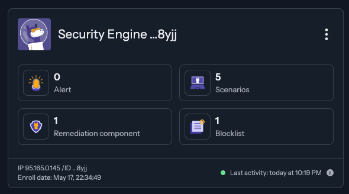
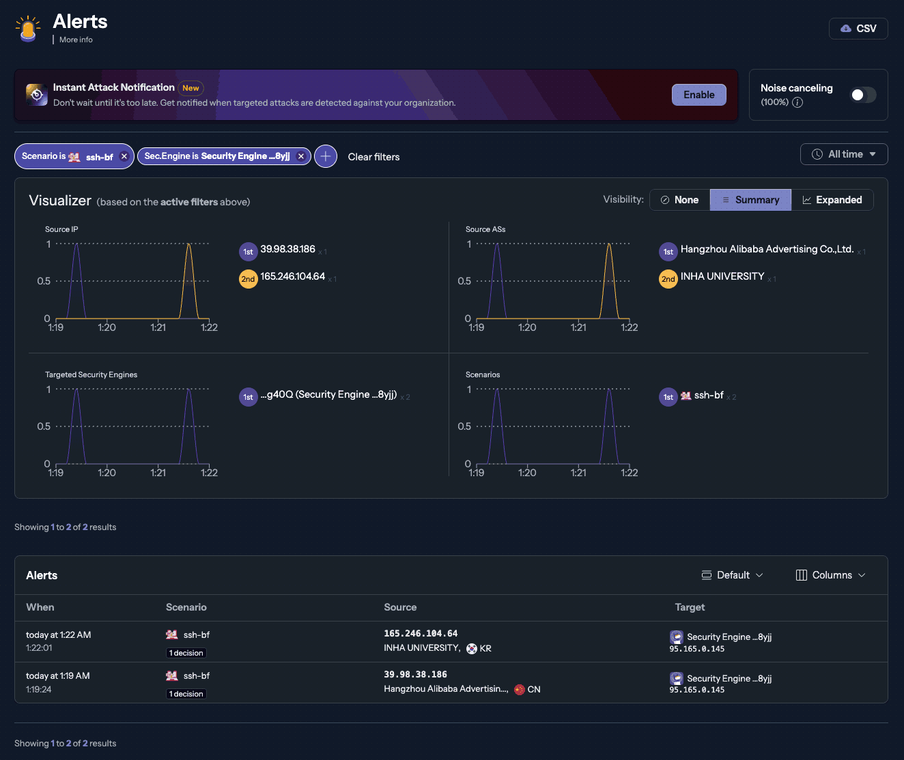

# Защита хоста с помощью CrowdSec

Вы наверняка использовали (или как минимум слышали) о Fail2Ban. Он очень широко распространён для защиты SSH на хостах,
противодействия сканированию сайтов, легких DDoS-атак и "фонового bot-трафика". Fail2Ban существует с 2004 года
и давно стал стандартом для защиты серверов. Но он слабо подходит для защиты кластеров Kubernetes, так поды
обслуживающие внешний трафик (Ingress-контроллеры Traefik в случае k3s) могут находиться на разных узлах кластера.
Если Fail2Ban заблокирует IP-адрес на одной ноде, то он не сможет защитить другие узлы кластера, так как они ничего
не узнают о блокировках. 

Для защиты распределённых систем (в том числе кластеров Kubernetes) набирает популярность CrowdSec. Это проект
с открытым исходным кодом, который, кроме обмена информацией об атаках между узлами (за периметром), использует
и внешний краудсорсинг (Community Blocklist) для защиты от атак. Он собирает данные о блокировках и позволяет
обмениваться этой информацией между всеми участниками сети (это отключаемая опция, и по умолчанию она отключена).
Таким образом, CrowdSec может не только защитить все узлы кластера (благодаря обмену информацией за периметром), 
о блокировать IP-адреса, еще до их атаки на ваш сервер (если данные IP уже заблокированы другими участниками CrowdSec).
А еще CrowdSec модульный, поддерживает сценарии (http-cms-scanning, sshd-bf и тому-подобное),в 60 раз быстрее
Fail2Ban (он написан на Golang), работает с IPv6 и имеет интеграции с Traefik, Cloudflare, Nginx, k3s, Docker и другими
инструментами. CrowdSec активно растёт в нише DevOps, облаков, контейнеров и кластеров Kubernetes. А еще он не
требовательный по ресурсам (~100 МБ RAM) и подходит для Orange Pi.

----
## Утановка CrowdSec 

В принципе, СrowdSec можно установить в кластер через Helm. Тогда он сам развернется на всех узлах кластера и это
отличный вариант для защиты Traefik (HTTP-запросы, сценарии http-cms-scanning, http-probing) и контейнеризированных
приложений (в моем случае [Gitea](../kubernetes/k3s-migrating-container-from-docker-to-kubernetes.md), [3x-ui](../kubernetes/k3s-3xui-pod.md) 
и тому подобного). Но мне нужно защитить еще и SSH самих узлов (узла) кластера. Поэтому план такой:

* Хостовый CrowdSec (на одном или всех узлах кластера) использует тот же Local API (LAPI) через виртуальный IP (VIP)
  Keepalived для получения бан-листа и применяет его к SSH (через Firewall Bouncer) и через тот же LAPI сообщает
  о банах ssh-bt в CrowdSec Agent внутри k3s.
* Кластерный CrowdSec Agent, внутри k3s, анализирует логи Traefik и создаёт решения (decisions) о бане IP.
* Traefik Bouncer в k3s, также подключается к LAPI для защиты HTTP (для git.cube2.ru и других web-приложений).

----
### CrowdSec на первом узле и защита SSH на хосте

----
#### Подготовка к установке CrowdSec

Делаем обновляем список пактов и систему: 
```shell
sudo apt update
sudo apt upgrade
```

Добавляем репозиторий CrowdSec и ключи репозитория:
```shell
curl -s https://packagecloud.io/install/repositories/crowdsec/crowdsec/script.deb.sh | sudo bash
```

----
#### Установка CrowdSec и проверка

Устанавливаем CrowdSec:
```shell
sudo apt install crowdsec
```

Увидим, в число прочего:
```text
...
...
reating /etc/crowdsec/acquis.yaml
INFO[2025-xx-xx xx:xx:xx] crowdsec_wizard: service 'ssh': /var/log/auth.log
INFO[2025-xx-xx xx:xx:xx] crowdsec_wizard: using journald for 'smb'
INFO[2025-xx-xx xx:xx:xx] crowdsec_wizard: service 'linux': /var/log/syslog /var/log/kern.log
Machine 'xxxxxxxxxxxxxxxxxxxxxxxxxxxxxxxxxxxxxxxxxxxxxxxx' successfully added to the local API.
API credentials written to '/etc/crowdsec/local_api_credentials.yaml'.
Updating hub
Downloading /etc/crowdsec/hub/.index.json
Action plan:
🔄 check & update data files


INFO[2025-05-17 17:56:45] crowdsec_wizard: Installing collection 'crowdsecurity/linux'
downloading parsers:crowdsecurity/syslog-logs
downloading parsers:crowdsecurity/geoip-enrich
downloading https://hub-data.crowdsec.net/mmdb_update/GeoLite2-City.mmdb
downloading https://hub-data.crowdsec.net/mmdb_update/GeoLite2-ASN.mmdb
downloading parsers:crowdsecurity/dateparse-enrich
downloading parsers:crowdsecurity/sshd-logs
downloading scenarios:crowdsecurity/ssh-bf
downloading scenarios:crowdsecurity/ssh-slow-bf
downloading scenarios:crowdsecurity/ssh-cve-2024-6387
downloading scenarios:crowdsecurity/ssh-refused-conn
downloading contexts:crowdsecurity/bf_base
downloading collections:crowdsecurity/sshd
downloading collections:crowdsecurity/linux
enabling parsers:crowdsecurity/syslog-logs
enabling parsers:crowdsecurity/geoip-enrich
enabling parsers:crowdsecurity/dateparse-enrich
enabling parsers:crowdsecurity/sshd-logs
enabling scenarios:crowdsecurity/ssh-bf
enabling scenarios:crowdsecurity/ssh-slow-bf
enabling scenarios:crowdsecurity/ssh-cve-2024-6387
enabling scenarios:crowdsecurity/ssh-refused-conn
enabling contexts:crowdsecurity/bf_base
enabling collections:crowdsecurity/sshd
enabling collections:crowdsecurity/linux
...
...
```

Как видим, CrowdSec сам определил, что у нас есть SSH и Linux (syslog и kern.log). Создан локальный API (LAPI)
м логин/пароль для него записан в `/etc/crowdsec/local_api_credentials.yaml`.

Далее CrowdSec загрузил парсеры, сценарии и коллекции для настройки защиты SSH и Linux.

Проверим, что CrowdSec работает:
```shell
sudo systemctl status crowdsec
```

Увидим что-то вроде:
```text
● crowdsec.service - Crowdsec agent
     Loaded: loaded (/lib/systemd/system/crowdsec.service; enabled; vendor preset: enabled)
     Active: active (running) since Sat xxxx-xx-xx xx:xx:xx XXX; 51min ago
   Main PID: 3357651 (crowdsec)
      Tasks: 14 (limit: 18978)
     Memory: 30.7M
        CPU: 18.233s
     CGroup: /system.slice/crowdsec.service
             ├─3357651 /usr/bin/crowdsec -c /etc/crowdsec/config.yaml
             └─3357715 journalctl --follow -n 0 _SYSTEMD_UNIT=smb.service

Xxx xx xx:xx:xx xxxx systemd[1]: Starting Crowdsec agent...
Xxx xx xx:xx:xx xxxx systemd[1]: Started Crowdsec agent.
```

Проверим версию CrowdSec:
```shell
sudo cscli version
```

Увидим что-то вроде:
```text
version: v1.6.8-debian-pragmatic-arm64-f209766e
Codename: alphaga
BuildDate: 2025-03-25_14:50:57
GoVersion: 1.24.1
Platform: linux
libre2: C++
User-Agent: crowdsec/v1.6.8-debian-pragmatic-arm64-f209766e-linux
...
...
```

Проверим список установленных парсеров:
```shell
sudo cscli parsers list
```

Увидим что-то вроде:
```text
──────────────────────────────────────────────────────────────────────────────────────────────────────────────
 PARSERS                                                                                                      
──────────────────────────────────────────────────────────────────────────────────────────────────────────────
 Name                            📦 Status    Version  Local Path                                             
──────────────────────────────────────────────────────────────────────────────────────────────────────────────
 crowdsecurity/dateparse-enrich  ✔️  enabled  0.2      /etc/crowdsec/parsers/s02-enrich/dateparse-enrich.yaml 
 crowdsecurity/geoip-enrich      ✔️  enabled  0.5      /etc/crowdsec/parsers/s02-enrich/geoip-enrich.yaml     
 crowdsecurity/smb-logs          ✔️  enabled  0.2      /etc/crowdsec/parsers/s01-parse/smb-logs.yaml          
 crowdsecurity/sshd-logs         ✔️  enabled  3.0      /etc/crowdsec/parsers/s01-parse/sshd-logs.yaml         
 crowdsecurity/syslog-logs       ✔️  enabled  0.8      /etc/crowdsec/parsers/s00-raw/syslog-logs.yaml         
 crowdsecurity/whitelists        ✔️  enabled  0.3      /etc/crowdsec/parsers/s02-enrich/whitelists.yaml       
──────────────────────────────────────────────────────────────────────────────────────────────────────────────
```

Как видим `crowdsecurity/sshd-logs` доступны, а значит CrowdSec может парсить логи SSH. Проверим список
установленных коллекций:
```shell
 sudo cscli collections list
```

Увидим что-то вроде:
```text
─────────────────────────────────────────────────────────────────────────────────
 COLLECTIONS                                                                     
─────────────────────────────────────────────────────────────────────────────────
 Name                 📦 Status    Version  Local Path                           
─────────────────────────────────────────────────────────────────────────────────
 crowdsecurity/linux  ✔️  enabled  0.2      /etc/crowdsec/collections/linux.yaml 
 crowdsecurity/smb    ✔️  enabled  0.1      /etc/crowdsec/collections/smb.yaml   
 crowdsecurity/sshd   ✔️  enabled  0.6      /etc/crowdsec/collections/sshd.yaml  
─────────────────────────────────────────────────────────────────────────────────
```

Видим, что `crowdsecurity/sshd` доступны. Проверим список установленных сценариев:
```shell
sudo cscli scenarios list
```

Увидим что-то вроде:
```text
SCENARIOS                                                                                             
───────────────────────────────────────────────────────────────────────────────────────────────────────
 Name                             📦 Status    Version  Local Path                                     
───────────────────────────────────────────────────────────────────────────────────────────────────────
 crowdsecurity/smb-bf             ✔️  enabled  0.2      /etc/crowdsec/scenarios/smb-bf.yaml            
 crowdsecurity/ssh-bf             ✔️  enabled  0.3      /etc/crowdsec/scenarios/ssh-bf.yaml            
 crowdsecurity/ssh-cve-2024-6387  ✔️  enabled  0.2      /etc/crowdsec/scenarios/ssh-cve-2024-6387.yaml 
 crowdsecurity/ssh-refused-conn   ✔️  enabled  0.1      /etc/crowdsec/scenarios/ssh-refused-conn.yaml  
 crowdsecurity/ssh-slow-bf        ✔️  enabled  0.4      /etc/crowdsec/scenarios/ssh-slow-bf.yaml       
───────────────────────────────────────────────────────────────────────────────────────────────────────
```

Сценарии `ssh-bf`, `crowdsecurity/ssh-slow-bf` (брутфорсинг и медленный брутфорсинг SSH),
`crowdsecurity/ssh-cve-2024-6387` (защита от regreSSHion-атак на старые SSH-сервера) и 
crowdsecurity/ssh-refused-conn` (отказ соединения SSH) доступны.

Кстати, обновлять все это богачество (парсеры, сценарии, коллекции и т.п.) можно командой:
```shell
sudo cscli hub update
```

Проверим конфиги CrowdSec, и убедимся, что он анализирует логи SSH:
```shell
sudo cat /etc/crowdsec/acquis.yaml
```

Должны увидеть вот такой блок:
```yaml
filenames:
  - /var/log/auth.log
labels:
  type: syslog
---
```

Если, вдруг, такого блока нет, добавьте его (лучше в начало) и перезапустим CrowdSec. Но обычно все уже настроено.

Проверим, что CrowdSec анализирует логи SSH:
```shell
sudo cscli metrics
```

Увидим что-то вроде:
```text
╭──────────────────────────────────────────────────────────────────────────────────────────────────────────────────╮
│ Acquisition Metrics                                                                                              │
├────────────────────────┬────────────┬──────────────┬────────────────┬────────────────────────┬───────────────────┤
│ Source                 │ Lines read │ Lines parsed │ Lines unparsed │ Lines poured to bucket │ Lines whitelisted │
├────────────────────────┼────────────┼──────────────┼────────────────┼────────────────────────┼───────────────────┤
│ file:/var/log/auth.log │ 628        │ -            │ 628            │ -                      │ -                 │
│ file:/var/log/kern.log │ 2.78k      │ -            │ 2.78k          │ -                      │ -                 │
│ file:/var/log/syslog   │ 3.46k      │ -            │ 3.46k          │ -                      │ -                 │
╰────────────────────────┴────────────┴──────────────┴────────────────┴────────────────────────┴───────────────────╯
...
...
```

Как видим, CrowdSec читает `/var/log/auth.log` (логи SSH).

----
#### Установка CrowdSec Firewall Bouncer -- блокировщик IP-адресов

По мне, блокировки CrowdSec довольно беззубые. К счастью через "вышибалу" Firewall Bouncer можно блокировать
IP-адреса по iptables (или nftables) и сделать CrowdSec злее fail2ban. Для этого нужно установить
`crowdsec-firewall-bouncer-iptables`:
```shell
sudo apt-get install crowdsec-firewall-bouncer-iptables
```
Проверим, что "вышибала" запустилась:
```shell
sudo systemctl status crowdsec-firewall-bouncer
```

Увидим что-то вроде:
```text
● crowdsec-firewall-bouncer.service - The firewall bouncer for CrowdSec
     Loaded: loaded (/etc/systemd/system/crowdsec-firewall-bouncer.service; enabled; vendor preset: enabled)
     Active: active (running) since Sun 2025-05-18 14:47:10 MSK; 723ms ago
    Process: 621537 ExecStartPre=/usr/bin/crowdsec-firewall-bouncer -c /etc/crowdsec/bouncers/crowdsec-firewall-bouncer.yaml -t (code=exited, status=0/SUCCESS)
    Process: 621674 ExecStartPost=/bin/sleep 0.1 (code=exited, status=0/SUCCESS)
   Main PID: 621622 (crowdsec-firewa)
      Tasks: 10 (limit: 18978)
     Memory: 7.4M
        CPU: 401ms
     CGroup: /system.slice/crowdsec-firewall-bouncer.service
             └─621622 /usr/bin/crowdsec-firewall-bouncer -c /etc/crowdsec/bouncers/crowdsec-firewall-bouncer.yaml

May 18 14:47:04 opi5 systemd[1]: Starting The firewall bouncer for CrowdSec...
May 18 14:47:10 opi5 systemd[1]: Started The firewall bouncer for CrowdSec.
```

Подключить его в CrowdSec:
```shell
sudo cscli bouncers add firewall-bounce
```

Проверим, что "вышибала" добавлен:
```shell
sudo cscli bouncers list
```

Увидим что-то вроде:
```text
─────────────────────────────────────────────────────────────────────────────────────────────────────────────────────────────────────────────
 Name                      IP Address  Valid  Last API pull         Type                       Version                             Auth Type 
─────────────────────────────────────────────────────────────────────────────────────────────────────────────────────────────────────────────
 cs-firewall-bouncer-xxxx  127.0.0.1   ✔️     xxxx-xx-xxTxx:xx:xxZ  crowdsec-firewall-bouncer  v0.0.31-debian-pragmatic-xxxxxx...  api-key   
 firewall-bouncer                      ✔️                                                                                          api-key   
─────────────────────────────────────────────────────────────────────────────────────────────────────────────────────────────────────────────
```

----
#### Подключаем наш CrowdSec к обмену данными об атаках

CrowdSec может обмениваться данными об атаках с другими участниками сети. Чтобы это сделать, нужно пойти [на сайт
CrowdSec](https://crowdsec.net/) и зарегистрироваться. После подтверждения регистрации по email, в личном кабинете
в самом низу, увидим строчку команды, типа:
```shell
sudo cscli console enroll -e context хеш-идентификатор-вашего-аккаунта
```

Скопируем эту команду и выполняем в терминале. Увидим что-то вроде:
```text
INFO manual set to true                           
INFO context set to true                          
INFO Enabled manual : Forward manual decisions to the console 
INFO Enabled tainted : Forward alerts from tainted scenarios to the console 
INFO Enabled context : Forward context with alerts to the console 
INFO Watcher successfully enrolled. Visit https://app.crowdsec.net to accept it. 
INFO Please restart crowdsec after accepting the enrollment. 
```

Как видим, нужно перезапустить CrowdSec:
```shell
sudo systemctl restart crowdsec
```

Теперь нужно снова зайти в личный кабинет CrowdSec и подтвердить подключение Security Engine.

Все! Подключение локального CrowdSec к Community Blocklist завершено. В личном кабинете можно посмотреть статистику
(по каждому Security Engine, ведь на один аккаунт можно подключить несколько хостов с CrowdSec) и даже управлять
фильтрами и сценариями (это не точно).



Проверим, что CrowdSec получает блокировки через Community Blocklist API (CAPI):
```shell
sudo cscli metrics
```

Увидим что-то типа:
```text
...
...
╭──────────────────────────────────────────╮
│ Local API Decisions                      │
├────────────────┬────────┬────────┬───────┤
│ Reason         │ Origin │ Action │ Count │
├────────────────┼────────┼────────┼───────┤
│ generic:scan   │ CAPI   │ ban    │ 3222  │
│ smb:bruteforce │ CAPI   │ ban    │ 427   │
│ ssh:bruteforce │ CAPI   │ ban    │ 10033 │
│ ssh:exploit    │ CAPI   │ ban    │ 1315  │
╰────────────────┴────────┴────────┴───────╯
...
```

Как видим, CrowdSec получает блокировки. Если очень интересно, можно посмотреть, что именно и почему блокируется
(например, `ssh:bruteforce`):
```shell
sudo cscli decisions list --origin CAPI
```

Увидим длиннющий список, примерно такого содержания:
```text
╭───────┬────────┬────────────────────────────────────┬────────────────┬────────┬─────────┬────┬────────┬────────────┬──────────╮
│   ID  │ Source │             Scope:Value            │     Reason     │ Action │ Country │ AS │ Events │ expiration │ Alert ID │
├───────┼────────┼────────────────────────────────────┼────────────────┼────────┼─────────┼────┼────────┼────────────┼──────────┤
  .....   ....     ......................               ..............   ...                     .        .........    .
│ ..... │ CAPI   │ Ip:129.211.204.27                  │ ssh:bruteforce │ ban    │         │    │ 0      │ 79h15m46s  │ 1        │
│ ..... │ CAPI   │ Ip:128.199.124.27                  │ ssh:bruteforce │ ban    │         │    │ 0      │ -1h44m14s  │ 1        │
│ ..... │ CAPI   │ Ip:Ip:2602:80d:1006::76            │ ssh:bruteforce │ ban    │         │    │ 0      │ 48h15m46s  │ 1        │
│ ..... │ CAPI   │ Ip:123.58.213.127                  │ ssh:bruteforce │ ban    │         │    │ 0      │ 160h15m46s │ 1        │
╰───────┴────────┴────────────────────────────────────┴────────────────┴────────┴─────────┴────┴────────┴────────────┴──────────╯
```

----
#### Настройка Whitelist (белого списка)

Чтобы не заблокировать себя (случайно) нужно создать в Whitelist (белый список). Например, сделаем `home_whitelist`
(имя списка, таких списков может быть несколько, и
```shell
sudo cscli allowlist create home_whitelist -d 'Мой домашний whitelist'
```

Теперь добавим в него свои домашнюю подсеть или IP-адрес (через пробел можно указать несколько адресов или подсетей):
```shell
sudo cscli allowlist add home_whitelist 192.168.1.0/24 XXX.XXX.XXX.XXX
````

Проверим, что все добавилось:
```shell
sudo cscli allowlist inspect home_whitelist
```

Увидим что-то вроде:
```text
──────────────────────────────────────────────
 Allowlist: home_whitelist                    
──────────────────────────────────────────────
 Name                home_whitelist           
 Description         Мой домашний whitelist   
 Created at          2025-05-17T21:00:13.042Z 
 Updated at          2025-05-17T21:01:29.090Z 
 Managed by Console  no                       
──────────────────────────────────────────────

───────────────────────────────────────────────────────────────
 Value           Comment  Expiration  Created at               
───────────────────────────────────────────────────────────────
 192.168.1.0/24           never       2025-05-17T21:00:13.042Z 
 XXX.XXX.XXX.XXX          never       2025-05-17T21:00:13.042Z 
 XXX.XXX.XXX.XXX          never       2025-05-17T21:00:13.042Z 
 ...
 ...
─────────────────────────────────────────────────────────────── 
```

Еще один способ отредактировать (создать) Whitelist-конфиг парсера, который мы получили командой
`sudo cscli parsers list`. Конфиг `/etc/crowdsec/parsers/s02-enrich/whitelists.yaml` довольно простой, если его
отредактировать (добавить нужные IP-адреса, подсети или даже доменные имена), а затем перезапустить CrowdSec -- получим
тот же результат. Только управлять через списки (allowlist) удобнее.
[См. документацию](https://doc.crowdsec.net/u/getting_started/post_installation/whitelists/).

----
#### Настройка Firewall Bouncer (блокировщик IP-адресов)

----
##### Сценарии блокировок

Когда мы проверяли установку CrowdSec, и проверим список сценариев `shell sudo cscli scenarios list`, то нам был
показан список yaml-манифестов c конфигурациями сценариев блокировок. Эти **сценарии занимаются распознаванием атак**, 
в частности касающихся SSH:
* `/etc/crowdsec/scenarios/ssh-bf.yaml` -- брутфорс SSH       
* `/etc/crowdsec/scenarios/ssh-slow-bf.yaml` -- медленный брутфорс SSH
* `/etc/crowdsec/scenarios/ssh-cve-2024-6387.yaml` -- regreSSHion-атака (атаки уязвимости SSH-серверов старых версий)
* `/etc/crowdsec/scenarios/ssh-refused-conn.yaml` -- отказ соединения SSH, защищает от сканеров, которые ищут
  открытые SSH-порты (на очень актуально, если у вас SSH открыт по стандартном 22-порту).

В некоторых манифестах может быть несколько блоков конфигурации блокировок для разных сценариев атак "зловредов".
Например, в `ssh-bf.yaml` есть блоки `crowdsecurity/ssh-bf` (для тупого брутфорса) и `crowdsecurity/ssh-bf_user-enum`
(для перебора пользователей). 

Меняем "беззубые" параметры, на что-то более серьезное. Открываем на редактирование, например, `ssh-bf.yaml`: 
```shell
sudo nano /etc/crowdsec/scenarios/ssh-bf.yaml
```

Увидим что-то типа:
```yaml
# ssh bruteforce
type: leaky
name: crowdsecurity/ssh-bf
description: "Detect ssh bruteforce"
filter: "evt.Meta.log_type == 'ssh_failed-auth'"
leakspeed: "10s"
references:
  - http://wikipedia.com/ssh-bf-is-bad
capacity: 5
groupby: evt.Meta.source_ip
blackhole: 1m
reprocess: true
labels:
  service: ssh
  confidence: 3
  spoofable: 0
  classification:
    - attack.T1110
  label: "SSH Bruteforce"
  behavior: "ssh:bruteforce"
  remediation: true
---
# ssh user-enum
type: leaky
name: crowdsecurity/ssh-bf_user-enum
description: "Detect ssh user enum bruteforce"
filter: evt.Meta.log_type == 'ssh_failed-auth'
groupby: evt.Meta.source_ip
distinct: evt.Meta.target_user
leakspeed: 10s
capacity: 5
blackhole: 1m
labels:
  service: ssh
  remediation: true
  confidence: 3
  spoofable: 0
  classification:
    - attack.T1589
  behavior: "ssh:bruteforce"
  label: "SSH User Enumeration"
```

Что тут происходит:

* Сценарий `crowdsecurity/ssh-bf`:
  * Тип: `leaky` --  leaky bucket — алгоритм "дырявое ведро", считающий события в окне времени. Метафора "дырявого
    ведра" в том, что из дырок на дне идет утечка со скоростью одна попытка за `leakspeed`. Емкость ведра равна
    `capacity`. Когда "ведро" было пустм, в него можно было поместить `capacity` событий, и после по одому событию
    в `leakspeed`. Если ведро переполнено событиями, то включается `blackhole` (черная дыра) и события игнорируются
    в течении `blackhole` времени.
  * Фильтр: `evt.Meta.log_type == 'ssh_failed-auth'` -- ловит неудачные попытки входа по SSH из `/var/log/auth.log`.
  * Логика:
    * `groupby: evt.Meta.source_ip` -- группирует события по IP атакующего.
    * `leakspeed: 10s` -- "окно времени" — 10 секунд (каждые 10 сек разрешена одна попытка).
    * `capacity: 5` -- Бан после 5 неудачных попыток.
    * `blackhole: 1m` -- Бан на 1 минуту.
* Сценарий `crowdsecurity/ssh-bf_user-enum`:
  * Тип тот же.
  * Фильтр тот же.
  * Логика:
    * `distinct: evt.Meta.target_user` -- считает попытки с разными пользователями (root, admin, pi, orangepi и т.д.).
    * `leakspeed: 10s` -- "окно времени" — 10 секунд.
    * `capacity: 5` -- Бан после 5 разных пользователей за 10 секунд.
    * `blackhole: 1m` -- Бан на 1 минуту.

Как видим в обоих случаях бан срабатывает после пяти попыток за десять секунд, и блокировка всего на минуту. Конечно,
брутфорсеры -- это быстрые атаки, но "быстрота" понятие относительное. Я выставляю:
* `leakspeed: 10m`
* `capacity: 2`
* `blackhole: 1h`

И считаю, что это довольно мягко. Но чтоб случайно не заблокировать себя, когда буду подключаться с внешнего IP
не из белого списка (например, по мобильному интернету) -- это разумный компромисс.

После редактирования файла, нужно перезапустить CrowdSec, чтоб он применил изменения:
```shell
sudo systemctl restart crowdsec
sudo systemctl restart crowdsec-firewall-bouncer
```

Другие сценарии можно настроить по аналогии. "Злость" управляется параметрами `leakspeed`, `capacity` и `blackhole`.
Но имейте в виду: не стоит менять много параметров одновременно. Настройки разных сценариев могут конфликтовать
друг другом, и тогда CrowdSec не запустится. 

После перезапуска CrowdSec:
```shell
sudo systemctl restart crowdsec
```

И еще, экспериментально я обнаружил, что настройки дней, например `2d` недопустимы. Надо указывать `48h` (48 часов),
и в целом не нужно сразу месть настройки сразу во всех сценариях. Они могут конфликтовать друг с другом, и CrowdSec
не перезапуститься. 

Проверим, что CrowdSec начал банить на основании настроенных правил (особо ждать не придется, зловреды попадутся уже через
пару минут):
```shell
sudo cscli decisions list
```

Увидим что-то типа:
```text
╭───────┬──────────┬───────────────────┬────────────────────────────────┬─────┬────┬────────────────────────┬────────┬────────────┬──────────╮
│   ID  │  Source  │    Scope:Value    │              Reason            │ Act │ Co │           AS           │ Events │ expiration │ Alert ID │
├───────┼──────────┼───────────────────┼────────────────────────────────┼─────┼────┼────────────────────────┼────────┼────────────┼──────────┤
│ 30004 │ crowdsec │ Ip:39.98.38.186   │ crowdsecurity/ssh-slow-bf      │ ban │ CN │ 37963 Hangzhou Alibaba │ 11     │ 3h54m49s   │ 6        │
│ 30002 │ crowdsec │ Ip:165.246.104.64 │ crowdsecurity/ssh-bf           │ ban │ KR │ 9317 INHA UNIVERSITY   │ 3      │ 3h50m0s    │ 4        │
│ 90210 │ crowdsec │ Ip:180.10.143.248 │ crowdsecurity/ssh-bf_user-enum │ ban │ CN │ 4134 Chinanet          │ 3      │ 3h6m38s    │ 216      │
╰───────┴──────────┴───────────────────┴────────────────────────────────┴─────┴────┴────────────────────────┴────────┴────────────┴──────────╯
```

----
##### Время блокировок

Сценарии занимаются распознаванием угроз, но самими блокировками они не занимаются. Блокировки настроены по умолчанию
на четыре часа, и это указано в профилях `/etc/crowdsec/profiles.yaml`. Чтобы изменить время, на которое "зловред"
отправляется в бан, нужно отредактировать этот файл. По умолчанию он вот такой:
```yaml
name: default_ip_remediation
#debug: true
filters:
 - Alert.Remediation == true && Alert.GetScope() == "Ip"
decisions:
 - type: ban
   duration: 4h
#duration_expr: Sprintf('%dh', (GetDecisionsCount(Alert.GetValue()) + 1) * 4)
# notifications:
#   - slack_default  # Set the webhook in /etc/crowdsec/notifications/slack.yaml before enabling this.
#   - splunk_default # Set the splunk url and token in /etc/crowdsec/notifications/splunk.yaml before enabling this.
#   - http_default   # Set the required http parameters in /etc/crowdsec/notifications/http.yaml before enabling this.
#   - email_default  # Set the required email parameters in /etc/crowdsec/notifications/email.yaml before enabling this.
on_success: break
---
name: default_range_remediation
#debug: true
filters:
 - Alert.Remediation == true && Alert.GetScope() == "Range"
decisions:
 - type: ban
   duration: 4h
#duration_expr: Sprintf('%dh', (GetDecisionsCount(Alert.GetValue()) + 1) * 4)
# notifications:
#   - slack_default  # Set the webhook in /etc/crowdsec/notifications/slack.yaml before enabling this.
#   - splunk_default # Set the splunk url and token in /etc/crowdsec/notifications/splunk.yaml before enabling this.
#   - http_default   # Set the required http parameters in /etc/crowdsec/notifications/http.yaml before enabling this.
#   - email_default  # Set the required email parameters in /etc/crowdsec/notifications/email.yaml before enabling this.
on_success: break
```

Как видим, по умолчанию блокировка на 4 часа. Чтобы изменить время блокировок, нужно отредактировать `duration: 4h` на
нужное. Но в конфигурации есть "заготовка" для динамического времени блокировок:
`duration_expr: Sprintf('%dh', (GetDecisionsCount(Alert.GetValue()) + 1) * 4)` -- каждый раз, когда зловред
попадает в бан, время блокировки увеличивается на 4 часа. То есть, если зловред попался в бан 5 раз, то его блокировка
будет 20 часов. И так далее (формулу, при желании, можно изменить). Это то, что нам нужно. Имейте в виду, что
подключение `duration_expr` исключает возможность указать `duration` (время блокировки) в секции `decisions`. Таким
образом получаем вот такой конфиг:
```yaml
name: default_ip_remediation
#debug: true
filters:
 - Alert.Remediation == true && Alert.GetScope() == "Ip"
decisions:
 - type: ban
   # duration: 4h
duration_expr: Sprintf('%dh', (GetDecisionsCount(Alert.GetValue()) + 1) * 4)
on_success: break
---
name: default_range_remediation
#debug: true
filters:
 - Alert.Remediation == true && Alert.GetScope() == "Range"
decisions:
 - type: ban
   duration: 5h
on_success: break
```

Можно добавлять и свои правила. Например, для более длительных блокировок медленных брутфорсов, добавим в конце:
```yaml
---
name: ssh_slow_bf_remediation
filters:
  - Alert.Remediation == true && Alert.Scenario == "crowdsecurity/ssh-slow-bf"
decisions:
  - type: ban
    duration: 10h
on_success: break
```

После сохранения конфига, перезапустим CrowdSec:
```shell
sudo systemctl restart crowdsec
```

И убедимся, что время блокировки увеличилось:
```shell
sudo cscli decisions list 
```
```text
╭────────┬──────────┬───────────────────┬──────────────────────┬────────┬─────────┬──────────────────────┬────────┬────────────┬──────────╮
│   ID   │  Source  │    Scope:Value    │        Reason        │ Action │ Country │          AS          │ Events │ expiration │ Alert ID │
├────────┼──────────┼───────────────────┼──────────────────────┼────────┼─────────┼──────────────────────┼────────┼────────────┼──────────┤
│ 165247 │ crowdsec │ Ip:165.246.104.64 │ crowdsecurity/ssh-bf │ ban    │ KR      │ 9317 INHA UNIVERSITY │ 3      │ 91h25m24s  │ 258      │
╰────────┴──────────┴───────────────────┴──────────────────────┴────────┴─────────┴──────────────────────┴────────┴────────────┴──────────╯
```

----
#### Web-панель

Плюсом CrowdSec является то, что благодаря обмену информацией о блокировках, в личном кабинете на сайте CrowdSec можно
посмотреть ваши локальные блокировки через веб-интерфейсе:



----
#### Управление блокировками

Можно добавить бан вручную (по умолчанию: `duration:4h` и `type:ban`):
```shell
sudo cscli decisions add -i xxx.xxx.xxx.xxx
sudo cscli decisions add --ip xxx.xxx.xxx.xxx --duration 24h --reason "любопытный безопасник"
sudo cscli decisions add --ip xxx.xxx.xxx.xxx --reason "web bruteforce" --type captcha
```

Снять блокировку отдельного IP, подсети (диапазона) или вообще все:
```shell
sudo cscli decisions delete --ip xxx.xxx.xxx.xxx
sudo cscli decisions delete --range yyy.yyy.yyyy.yyy/24
sudo cscli decisions delete --all
```

#### Блокировки по GeoIP

Проверим, что у нас есть парсер на основе GeoIP:
```shell
sudo cscli parsers lis
```

Увидим в числе прочих:
```text
 PARSERS                                                                                                              
──────────────────────────────────────────────────────────────────────────────────────────────────────────────────────
 Name                            📦 Status            Version  Local Path                                             
──────────────────────────────────────────────────────────────────────────────────────────────────────────────────────
crowdsecurity/geoip-enrich      ✔️  enabled          0.5      /etc/crowdsec/parsers/s02-enrich/geoip-enrich.yaml 
```

Он обогащает события (events) GeoIP-информацией: страна, город, ASN, континент и так далее, но сам ничего не блокирует —
он просто добавляет поля к событиям. Но это делает возможным создание собственных фильтров и сценариев,
завязанных на GeoIP. Используется двухбуквенный код страны (стандарт ISO-3166-1 alpha-2). 

Создадим свой сценарий, например, для Китая и Кореи, за ними, с большим отрывом, Индия и Индонезия (вот честно,
ничего против этих стран не имею, от из этих регионов 80% всех атак на мой SSH):
```shell
sudo nano /etc/crowdsec/scenarios/ban-cn--geoip.yaml
```

И вставим туда:
```yaml
# /etc/crowdsec/scenarios/ban-cn--geoip.yaml
# Бан по GeoIP для Китая и Кореи
type: trigger
name: local/ban-russian-ips
description: "Ban any IP from China & Korea"
filter: evt.Meta.geoip_country in ['CN', 'KR'] 
groupby: evt.Meta.source_ip
labels:
  country_ban: CN
  remediation: true
  classification:
    - abuse
  behavior: "geoip:ban"
  confidence: 5
  label: "GeoIP Country Ban"
  manual: true
```

Как видно, это `trigger`-сценарий, он срабатывает при одиночном совпадении, без необходимости "накопить
события", как в `leaky`. 

Перезапустим CrowdSec:
```shell
sudo systemctl restart crowdsec
```

Теперь CrowdSec будет автоматически блокировать все новые IP из указанных стран при появлении их в логах. Для SSH,
в моем случае. Но принцип понятен. И если честно, можно вообще все страны забанить, кроме тех, где бываю в отпуске.
Нечего им делать на моем сервере. :)

