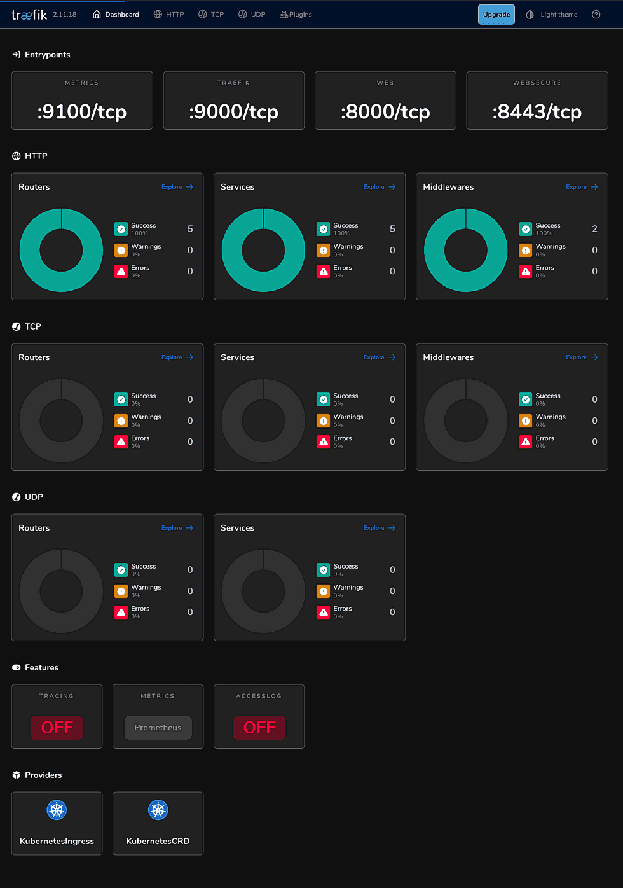

# Развертывание k3s на  Orange Pi 

K3s — это облегчённая версия Kubernetes, созданная для слабых или малых серверов (Raspberry Pi, Orange Pi,
IoT-устройства, edge-серверы и т.п.). Для кластера из нескольких Orange Pi он предпочтительнее, так как:

* K3S менее требователен к ресурсам (Полный k8s на ARM может сожрать 1-2 ГБ только на управление кластером,
  а k3s занимает ~500 МБ.
* K3s проще устанавливать и обновлять. Shell-скрипт с [https://get.k3s.io](get.k3s.io) все сделает сам, и не нужно 
  погружаться сложные настройки kubeadm. Обычный Kubernetes состоит из множества компонентов: kube-apiserver,
  kube-controller-manager, kube-scheduler, kubelet на каждой ноде, kube-proxy, etcd и т.д. В K3s всё это 
  упаковано в один бинарник.
* Всё работает "из коробки" благодаря встроенному Flannel (CNI) и не надо вручную настраивать Calico, Weave, Cilium. 
* В отличие от "классического" Kubernetes (например, kubeadm), где мастер-узлы по умолчанию изолированы от рабочих нагрузок с помощью taint'ов (например, NoSchedule), k3s не добавляет такие ограничения автоматически. Это значит:
* Для моего проекта особо важно, что из коробки мастер-узел(ы)) в k3s является "гибридным" и выполняет одновременно 
  функции управления (control-plane) и может запускать обычные поды, как воркер. Компоненты управления (API-сервер,
  контроллеры, etcd) работают как системные сервисы, а для пользовательских подов используется тот же kubelet,
  что и на воркерах. _**Кстати, что такое "поды".** Контейнеры в Kubernates называют "поды", чтобы отличать их от
  Docker-контейнеров и подчёркивать, что это абстракция уровня оркестрации. Но под — это не просто контейнер, это
  сущность Kubernetes, которая может включать несколько контейнеров, сетевые настройки и тома. Но под капотом
  контейнеры всё равно запускаются runtime’ом (это containerd в k3s). И Docker все равно еще нужен для создания
  образов, и если при установке k3s не указать `--docker` то k3s будет использовать его как runtime._ 

Но, есть у k3s и минус для конкретно моего случая — распределенная база **etcd**, в которой хранится состояния
кластера, нод и подов, в нем заменена SQLite. Это круто для маленьких компьютеров: экономно по памяти и другим ресурсам,
и, что главное, никак не сказывается на производительности (пока узлов меньше 50-80), но означает, что в кластере k3s
может быть только одна мастер-нода. Если мастер-нода упадет, её некому будет заменить и весь кластер умрет.
Мне же надо, чтобы как миниум две (а лучше все) ноды могли быть мастерами, так что я буду делать k3s-кластер
с использованием *etcd*.

### Важное предупреждение

k3s — это не упрощенная мини-версия Kubernetes, здесь все компоненты упакованы в один бинарник, а значит намного
проще не только добавлять узлы, но и удалять их. Так что если что-то пойдет не так с настройкой узла, просто удалите
и начните заново. Удаление k3s с узла:
```bash 
sudo /usr/local/bin/k3s-uninstall.sh  # На мастерах
sudo /usr/local/bin/k3s-agent-uninstall.sh  # На воркере
```

## Установка k3s на первом узле (мастер)

Некоторые требования к узлам:
* На всех Orange Pi установлена одинаковая версия Ubuntu (например, 22.04 или 24.04).
* Статические IP-адреса узлов (или зрезервированные под MAC-адреса IP в DHCP).
* На уздах открыты порты 6443 (для API), 2379-2380 (для etcd) и 10250 (для kubelet).

 
Установливаем первый мастер:
```bash
curl -sfL https://get.k3s.io | sh -s - server --cluster-init --tls-san=192.168.1.27
```

Здесь:
*  `server` — значение по умолчанию, устанавливает узел k3s в режиме *мастер* (control-plane). В этом режиме узел
   будет запускать все компоненты управления Kubernetes: API-сервер, контроллер-менеджер, планировщик (scheduler).
   Такой узел отвечает за управление кластером и может также выполнять рабочие нагрузки (workloads), если
   не настроены ограничения (taints). Если бы мы указали `agent` — был бы установлен узел k3s в режиме *воркер*-узла.
* `--cluster-init` — добавляет поддержку высокой доступности (HA — High Availability) через встроенный `etcd`. Это
   значит, что узел инициализирует новый кластер и готов к тому, чтобы другие мастер-узлы могли к нему подключиться
   (для создания HA-конфигурации).
* `--tls-san=192.168.1.27` — добавляет IP 192.168.1.27 в сертификаты API-сервера, чтобы другие узлы и клиенты
  могли обращаться к нему по этому адресу.

Проверим, что все k3s запущен:
```bash
sudo service k3s status
```

Увидим что-то типа:
```text
● k3s.service - Lightweight Kubernetes
     Loaded: loaded (/etc/systemd/system/k3s.service; enabled; vendor preset: enabled)
     Active: active (running) since …
…
…
```

Посмотрим сколько нод в кластере:
```bash
sudo kubectl get nodes
```

И, та-да! Увидим одну ноду:
```text
NAME         STATUS   ROLES                       AGE   VERSION
opi5plus-2   Ready    control-plane,etcd,master   31m   v1.31.5+k3s1
```

Как видим, узел `opi5plus-2` готов к работе и выполняет роли *control-plane*, *etcd* и *master*.


А что там внутри? Посмотрим на поды:
```bash
sudo kubectl get pods -A
```

Целых семь подов (минималистичная установка k3s):
```text
NAMESPACE     NAME                                      READY   STATUS      RESTARTS   AGE
kube-system   coredns-ccb96694c-tfjwj                   1/1     Running     0          13m
kube-system   helm-install-traefik-crd-bdbgd            0/1     Completed   0          13m
kube-system   helm-install-traefik-mlztm                0/1     Completed   1          13m
kube-system   local-path-provisioner-5cf85fd84d-jwz5n   1/1     Running     0          13m
kube-system   metrics-server-5985cbc9d7-n9dwz           1/1     Running     0          13m
kube-system   svclb-traefik-4f8c2580-jddgz              2/2     Running     0          12m
kube-system   traefik-5d45fc8cc9-t5d58                  1/1     Running     0          12m
```

Тут статус X/Y в выводе kubectl get pods показывает:
* Y — сколько контейнеров должно быть в поде (по спецификации).
* X — сколько из них сейчас работает (running).

Представлены следующие поды:
1. `coredns` — это DNS-сервер для кластера. Он отвечает за разрешение имен внутри Kubernetes (например, чтобы поды
   могли обращаться друг к другу по именам сервисов вроде my-service.default.svc.cluster.local).
2. `helm-install-traefik-crd` — это временный под (Job), который устанавливает Custom Resource Definitions (CRD)
   для *Traefik* — ingress-контроллера, встроенного в k3s. CRD нужны для управления ingress-ресурсами
   (маршрутизацией HTTP/HTTPS). Этот под — одноразовая задача (Job), а не постоянный сервис. Он запустился, выполнил 
   работу (установил CRD) и завершился. Статус "*Completed*" значит, что он больше не работает.
3. `helm-install-traefik` — ещё один Job, который устанавливает сам Traefik через Helm-чарт. Этот под развернул 
   основной Traefik-под и завершился.
4. `local-path-provisioner` — компонент для автоматического создания локальных Persistent Volumes (PV) на узлах. Он
   позволяет подам запрашивать хранилище (например, через PersistentVolumeClaim) без сложной настройки NFS или внешних
   хранилищ. В k3s это встроено для простоты.
5. `metrics-server` — собирает данные об использовании ресурсов (CPU, память) подов и узлов. Это нужно для команд
   вроде `kubectl top` или для Horizontal Pod Autoscaler (HPA). Установку метрик можно отключить при запуске k3s
   флагом `--disable=metrics-server`.
6. `svclb-traefik` - это под для балансировки нагрузки (Service Load Balancer) для Traefik. В k3s нет встроенного
   облачного балансировщика (как в AWS/GCP), поэтому *svclb* эмулирует его на уровне узла, перенаправляя трафик
   к сервисам типа LoadBalancer. У нас два таких контейнера:
   * один для самой логики балансировки;
   * другой для мониторинга или дополнительной функциональности (например, *keepalived* или аналога) и это зависит
     от реализации в k3s.
7. `traefik` — сам Traefik, ingress-контроллер, который обрабатывает HTTP/HTTPS трафик кластера и маршрутизирует
    его к соответствующим подам (с динамической конфигурацией нашим) и сервисам по правилам Ingress. Traefik в k3s
    установлен по умолчанию, но его можно отключить при запуске k3s флагом `--disable=traefik` (не будет ни *traefik*,
    ни *svclb*, ни связанных *Helm Jobs*).

Обратите внимание, что, например, под `coredns` получил имя `coredns-ccb96694c-tfjwj`. Имена подов (Pod Names)
в Kubernetes генерируются автоматически на основе правил, чтобы каждый под в кластере имел уникальное имя.
Структура имени — `<имя-приложения>-<хеш-ревизии>-<случайный-суффикс>`. Впрочем, `<хеш-ревизии>` может отсутствовать,
если под не имеет контроллера репликации (например, Job или CronJob).

Можно проверить, что API нашего узла (кластера) отвечает:
```bash
curl -k https://192.168.1.27
```

Здесь ключ `-k` означает, что мы не проверяем сертификаты (нам важно только, что сервер отвечает). Должны получить
Unauthorized JSON-ответ от API. Что-то вроде:
```json
{
  "kind": "Status",
  "apiVersion": "v1",
  "metadata": {},
  "status": "Failure",
  "message": "Unauthorized",
  "reason": "Unauthorized",
  "code": 401
}
```

## Подключение второго узла (мастер)


Для начала, на первой ноде получим токен для подключения нового узла к кластеру:
```bash
sudo cat /var/lib/rancher/k3s/server/node-token
```

Вывод будет что-то вроде `K10…::server:longrandomstring`. Это и есть токен, который нужно будет использовать.

Теперь на втором Orange Pi (например, с IP 192.168.1.28) можно запустить второй мастер-узел (вставим токен
из предыдущего шага):
```bash
curl -sfL https://get.k3s.io | sh -s - server --server https://192.168.1.27:6443 --token <ТОКЕН> --tls-san=192.168.1.28
```
Здесь ключи:
* `--server https://192.168.1.27:6443` — указывает на API мастер-узла, чтобы наш новый узел мог подключиться к кластеру.
* `--token` — токен аутентификации из предыдущего шага.
* `--tls-san=192.168.1.28` — добавляет IP нашего второго мастера в сертификаты (для будущих подключений).

Проверим какие теперь ноды в кластере:
```bash
sudo k3s kubectl get nodes
```

Теперь увидим две ноды:
```text
NAME         STATUS   ROLES                       AGE    VERSION
opi5plus-2   Ready    control-plane,etcd,master   2h     v1.31.5+k3s1
opi5plus-3   Ready    control-plane,etcd,master   110s   v1.31.5+k3s1
```

Проверим поды кластера и посмотрим на каких нодах они запущены:
```bash
sudo k3s kubectl get pods -A -o wide
```

И увидим, что на второй ноде запустились те же поды, что и на первой:
```text
NAMESPACE     NAME                                      READY   STATUS      RESTARTS   AGE   IP          NODE         NOMINATED NODE   READINESS GATES
kube-system   coredns-ccb96694c-tfjwj                   1/1     Running     0          2h    10.42.0.4   opi5plus-2   <none>           <none>
kube-system   helm-install-traefik-crd-bdbgd            0/1     Completed   0          2h    <none>      opi5plus-2   <none>           <none>
kube-system   helm-install-traefik-mlztm                0/1     Completed   1          2h    <none>      opi5plus-2   <none>           <none>
kube-system   local-path-provisioner-5cf85fd84d-jwz5n   1/1     Running     0          2h    10.42.0.3   opi5plus-2   <none>           <none>
kube-system   metrics-server-5985cbc9d7-n9dwz           1/1     Running     0          2h    10.42.0.2   opi5plus-2   <none>           <none>
kube-system   svclb-traefik-4f8c2580-jddgz              2/2     Running     0          2h    10.42.0.7   opi5plus-2   <none>           <none>
kube-system   svclb-traefik-4f8c2580-xzt5d              2/2     Running     0          2m35s 10.42.1.2   opi5plus-3   <none>           <none>
kube-system   traefik-5d45fc8cc9-t5d58                  1/1     Running     0          2h    10.42.0.8   opi5plus-2   <none>           <none>
```

Как видим, у нас появился еще один `svclb-traefik` на второй ноде. Это под — Service Load Balancer (SLB) для Traefik.
Он эмулирует облачный балансировщик нагрузки (типа AWS ELB), которого нет в локальном окружении вроде Orange Pi.
SLB перенаправляет внешний трафик (например, на порты 80/443) к сервисам типа LoadBalancer внутри кластера.

## Подключение третьего узла (воркера)

Добавление третьего узда в качестве воркера (рабочего узла) мы сделаем временно. Во-первых, чтобы показать как это
делается, а во-вторых, чтобы показать как удалять узел и с какими особенностями это связано. И наконец, в-третьих,
объяснить что такое кворум и почему важно, чтобы в кластере было нечетное количество мастер-узлов.

И так, подключение рабочего узла даже проще, чем мастера. Выполним на нашем новом узле:
```bash
curl -sfL https://get.k3s.io | sh -s - agent --server https://192.168.1.10:6443 --token <ТОКЕН>
```

Здесь ключ:
* `agent` — устанавливает узел в режиме воркера (worker). Это значит, что узел будет выполнять рабочие нагрузки
  (поды), но не будет управлять кластером (без *control-plane*, *master* и на нем нет реплики *etcd*).

Посмотрим на ноды (команда выполняется на одном из мастер-узлов):
```bash
sudo k3s kubectl get nodes
```

Теперь у нас три ноды, и все они имеют статус *Ready*:
```text
NAME         STATUS   ROLES                       AGE   VERSION
opi5plus-1   Ready    <none>                      96s   v1.31.5+k3s1
opi5plus-2   Ready    control-plane,etcd,master   3h    v1.31.5+k3s1
opi5plus-3   Ready    control-plane,etcd,master   2h    v1.31.5+k3s1
```

Новая нода `opi5plus-1` готова к работе и не имеет ролей, а только выполняет рабочие нагрузки (поды).

Посмотрим на поды:
```bash
sudo k3s kubectl get pods -n kube-system -o wide
```

И увидим, что на новом воркере (opi5plus-1) запустился под балансировщика `svclb-traefik`:
```text
NAME                                      READY   STATUS      RESTARTS   AGE   IP          NODE         NOMINATED NODE   READINESS GATES
coredns-ccb96694c-tfjwj                   1/1     Running     0          3h    10.42.0.4   opi5plus-2   <none>           <none>
helm-install-traefik-crd-bdbgd            0/1     Completed   0          3h    <none>      opi5plus-2   <none>           <none>
helm-install-traefik-mlztm                0/1     Completed   1          3h    <none>      opi5plus-2   <none>           <none>
local-path-provisioner-5cf85fd84d-jwz5n   1/1     Running     0          3h    10.42.0.3   opi5plus-2   <none>           <none>
metrics-server-5985cbc9d7-n9dwz           1/1     Running     0          3h    10.42.0.2   opi5plus-2   <none>           <none>
svclb-traefik-4f8c2580-4q7dj              3/3     Running     0          92s   10.42.2.2   opi5plus-1   <none>           <none>
svclb-traefik-4f8c2580-h7b9c              3/3     Running     0          2h    10.42.0.9   opi5plus-2   <none>           <none>
svclb-traefik-4f8c2580-qmzf6              3/3     Running     0          2h    10.42.1.5   opi5plus-3   <none>           <none>
traefik-6c979cd89d-98fk8                  1/1     Running     0          1h    10.42.1.6   opi5plus-3   <none>           <none>
```

Посмотрим состояние сервисов в кластере:
```bash
sudo k3s kubectl get service -n kube-system
```

Увидим, что сервис *traefik* доступен на всех нодах:
```text
NAME             TYPE           CLUSTER-IP      EXTERNAL-IP                              PORT(S)                                     AGE
kube-dns         ClusterIP      10.43.0.10      <none>                                   53/UDP,53/TCP,9153/TCP                      3d
metrics-server   ClusterIP      10.43.248.208   <none>                                   443/TCP                                     3d
traefik          LoadBalancer   10.43.164.48    192.168.1.26,192.168.1.27,192.168.1.28   80:31941/TCP,443:30329/TCP,9000:32185/TCP   3d
```

Можем проверить доступность панели `Traefik` через браузер через IP-адрес нового узла и (в нашем случае `http://192.168.1.26:9000/dashboard/#/`)
и увидим, что балаансировщик работает и перенаправляет трафик и с ноды воркера.



Что ж, теперь у нас есть кластер k3s с тремя нодами: двумя мастерами и одним воркером. Но, как я уже говорил, это не
идеальная конфигурация, так как у нас четное количество мастер-узлов.

Попробует отключить один из мастеров (не обязательно выключать питание, достаточно отсоединить сетевой кабель ethernet)
и посмотрим что произойдет.

Само-собой доступ к панели Traefik на "погашенном узле" пропадет, но с обоих работающих узлов (живого мастера
и воркера) сохранится. И еще будет потеряна возможность работать с кластером через `kubectl`. Почему kubectl
не работает на втором мастере? Ошибка на втором мастере после отключения первого говорит о том, что кластер потерял
полную функциональность API-сервера. Как говорилось ранее, k3s с настройкой HA (высокая доступность) используется
встроенный etcd для хранения состояния. Для работы etcd в HA-режиме требуется кворум.

Кворум в etcd — это минимальное количество узлов, которые должны быть доступны для согласования данных и принятия
решений в кластере. Это основа отказоустойчивости распределённой системы. При двух мастерах: **Кворум = N/2 + 1**,
где N — количество мастер-узлов. Для 2 узлов: *кворум = 2/2 + 1 = 2*. Это значит, что оба мастера должны быть живы,
чтобы etcd работал. Если один мастер падает, второй не может достичь кворума (1 < 2) и останавливает работу etcd.
Без etcd API-сервер на втором мастере не может отвечать на запросы kubectl, хотя поды продолжают работать, так как
им не нужен доступ к etcd в реальном времени.

В чем может быть смысл иметь два мастера? Это обеспечивает репликацию данных (второй хранит копию etcd), но не
даёт отказоустойчивости — когда один мастер упал, кластер становится неуправляемым (нет управления через kubectl), 
рабочие нагрузки (поды) могут продолжать работать, пока жив хотя бы один узел, но новые изменения (развертывание
подов и обновления) невозможны.

Таким образом, два мастера это не идеальная HA (High Availability), а скорее "полу-HA". Полная HA начинается
с трёх узлов! Три мастера — это стандарт для настоящей отказоустойчивости в Kubernetes (и k3s). При трёх мастерах:
**Кворум = 3/2 + 1 = 2**. Это значит, что кластер остаётся рабочим, если один мастер уме, но живы минимум 2 из 3.
Два оставшихся поддерживают кворум (2 >= 2), и кластер полностью управляем (kubectl работает и можно деплоить поды).

### Удаление узла из кластера

Чтобы снова получить возможность управлять кластером включим погашенный мастер-узел, подождем пока кворум восстановится
и удалим с k3s воркер-узел (opi5plus-1):
```bash
sudo /usr/local/bin/k3s-agent-uninstall.sh
```

Теперь состояние узлов в кластере:
```text
NAME         STATUS     ROLES                       AGE    VERSION
opi5plus-1   NotReady   <none>                      147m   v1.31.5+k3s1
opi5plus-2   Ready      control-plane,etcd,master   3d2h   v1.31.5+k3s1
opi5plus-3   Ready      control-plane,etcd,master   2d     v1.31.5+k3s1
```

Нода со статусом `NotReady` с ролью `<none>` — это остатки бывшего воркера. Если запустить на том же хосте масте, узел
может "ожить" и перерегистрироваться с новыми ролями. Но это не обязательно удалит старый объект Node — он может
либо обновиться (если имя совпадает), либо создать дубликат, что приведёт к путанице. Надежнее удалить старый узел из
кластера:
```bash
sudo k3s kubectl delete node opi5plus-1
```

Теперь состояние узлов:
```text
NAME         STATUS     ROLES                       AGE    VERSION
opi5plus-2   Ready      control-plane,etcd,master   3d2h   v1.31.5+k3s1
opi5plus-3   Ready      control-plane,etcd,master   2d     v1.31.5+k3s1
```

После удаления узла, проверим состояние подов кластера (правильнее, конечно, было бы проверить поды до удаления узла,
но, допустим, мы имитировали ситуацию "смерти" узла):
```bash
sudo k3s kubectl get pods -n kube-system -o wide
```

Увидим:
```text
NAME                                      READY   STATUS        RESTARTS   AGE     IP          NODE         NOMINATED NODE   READINESS GATES
coredns-ccb96694c-tfjwj                   1/1     Running       0          4d19h   10.42.0.4   opi5plus-2   <none>           <none>
helm-install-traefik-crd-bdbgd            0/1     Completed     0          4d19h   <none>      opi5plus-2   <none>           <none>
helm-install-traefik-mlztm                0/1     Completed     1          4d19h   <none>      opi5plus-2   <none>           <none>
local-path-provisioner-5cf85fd84d-jwz5n   1/1     Running       0          4d19h   10.42.0.3   opi5plus-2   <none>           <none>
metrics-server-5985cbc9d7-n9dwz           1/1     Running       0          4d19h   10.42.0.2   opi5plus-2   <none>           <none>
svclb-traefik-4f8c2580-h7b9c              3/3     Running       0          2d18h   10.42.0.9   opi5plus-2   <none>           <none>
svclb-traefik-4f8c2580-nhz65              3/3     Running       0          38h     10.42.2.2   opi5plus-1   <none>           <none>
svclb-traefik-4f8c2580-qmzf6              3/3     Running       0          2d18h   10.42.1.5   opi5plus-3   <none>           <none>
traefik-6c979cd89d-98fk8                  1/1     Terminating   0          2d15h   10.42.1.6   opi5plus-3   <none>           <none>
traefik-6c979cd89d-t4rhw                  1/1     Running       0          38h     10.42.2.3   opi5plus-1   <none>           <none>
```

Если бы у нас были рабочие поды на удаленном узле, то они бы перезапустились на других нодах. Но, у нас там был только
`svclb-traefik`, который теперь стал в статусе `Terminating`. Это процесс удаления пода. Kubernetes не сразу удаляет
поды, особенно если они находятся в состоянии "зависания" (например, `Terminating` или  `Running`, но стали недоступны). 
Так как агент удалён вместе с узлом, то некому сообщить кластеру, что под завершил работу, и он остается "призраком"
в списке. Удалим под `svclb-traefik` вручную (не забудьте заменить `xxxxxxxxx-xxxxx` на реальные значения
`<хеш-ревизии>`и `<суффикс>`):
```bash
sudo k3s kubectl delete pod svclb-traefik-xxxxxxxxx-xxxxx -n kube-system --force --grace-period=0
```

Здесь `--force` и `--grace-period=0` говорят Kubernetes удалить под "форсированно" и "немедленно". Даже если узел
недоступен. Так как это DaemonSet, он не перезапустится на opi5plus-1, потому что узел уже NotReady. 

## Добавление третьего мастера

Теперь у нас осталось две мастер-ноды и можно добавить третий мастер. Как это сделать, см выше. Но теперь
при добавлении можно в флаге `--server` указать IP как первого, так и второго мастера. И не забудьте в `--tls-san`
указать IP хоста нового (третьего) мастера.

### Тюнинг kube-dns

После установки можно попробовать отключить один из мастеров и убедиться, что кластер остаётся работоспособным,
а спустя некоторое время (иногда 10-15 минут) поды с погашенного мастера перезапустятся на других нодах. Например:
```text
NAME                                      READY   STATUS        RESTARTS       AGE    IP           NODE         NOMINATED NODE   READINESS GATES
coredns-ccb96694c-wzh96                   1/1     Running       0              101m   10.42.1.8    opi5plus-3   <none>           <none>
local-path-provisioner-5cf85fd84d-s9frj   1/1     Running       0              101m   10.42.1.9    opi5plus-3   <none>           <none>
metrics-server-5985cbc9d7-q525g           1/1     Terminating   0              101m   10.42.2.4    opi5plus-1   <none>           <none>
metrics-server-5985cbc9d7-v8vlt           1/1     Running       0              29m    10.42.0.12   opi5plus-2   <none>           <none>
svclb-traefik-4f8c2580-h7b9c              3/3     Running       3 (35m ago)    3d2h   10.42.0.10   opi5plus-2   <none>           <none>
svclb-traefik-4f8c2580-nhz65              3/3     Running       0              47h    10.42.2.2    opi5plus-1   <none>           <none>
svclb-traefik-4f8c2580-qmzf6              3/3     Running       3 (133m ago)   3d2h   10.42.1.7    opi5plus-3   <none>           <none>
traefik-6c979cd89d-t4rhw                  1/1     Terminating   0              46h    10.42.2.3    opi5plus-1   <none>           <none>
traefik-6c979cd89d-z6wwm                  1/1     Running       0              29m    10.42.0.11   opi5plus-2   <none>           <none>
```

Хотя, в целом, кластер остается рабочим, и сам чинится при отключении и восстановлении узлов, но если отключается нода
на которой исполняется под с `coredns` — то временно будет затруднен перезапуска и создание новых подов, а значит
и "переезд" подов с погашенного узла, до восстановления `coredns` тоже будет замедлен. Кроме того, если сценарий
приложения(ий) развернутых внутри k3s предполагает переподключение с использованием имен подов или обнаружение подов,
то это тоже перестанет работать.

Решением может быть использование двух реплик `coredns` (вместо одной). Откроем файл конфигурации k3s на редактирование:
```bash
sudo k3s kubectl edit deployment coredns -n kube-system
```

Здесь:
* `kubectl edit` — Открывает редактор (по умолчанию *vim*) для изменения ресурса Kubernetes напрямую в кластере. 
  Вместо создания локального YAML-файла и применения его через `kubectl apply`, мы сразу редактируем "живой" конфиг.
* `deployment coredns` — Указывает, что редактируем объект типа *deployment* с именем `coredns`. Deployment — это
  контроллер, который управляет набором подов (в данном случае coredns), обеспечивая их количество (реплики),
  перезапуск и обновления.
* `-n kube-system` — Указывает пространство имён (namespace), где находится *coredns8. В k3s системные компоненты,
  к которым относится *coredns(, обычно живут в kube-system.

В открывшемся окне найдем строку `replicas: 1` и заменим её на `replicas: 2`.
```yaml
spec:
  progressDeadlineSeconds: 600
  replicas: 2
  revisionHistoryLimit: 0
```

Сохраним изменения и выйдем из редактора. Изменения сразу применятся, и k3s создаст вторую реплику `coredns`:
```text
NAME                                      READY   STATUS              RESTARTS        AGE     IP           NODE         NOMINATED NODE   READINESS GATES
coredns-ccb96694c-n4qsp                   0/1     ContainerCreating   0               5s      <none>       opi5plus-1   <none>           <none>
coredns-ccb96694c-wzh96                   1/1     Running             0               3h10m   10.42.1.8    opi5plus-3   <none>           <none>
…
```

А затем:
```text
NAME                                      READY   STATUS    RESTARTS        AGE     IP           NODE         NOMINATED NODE   READINESS GATES
coredns-ccb96694c-n4qsp                   1/1     Running   0               15s     10.42.2.6    opi5plus-1   <none>           <none>
coredns-ccb96694c-wzh96                   1/1     Running   0               3h10m   10.42.1.8    opi5plus-3   <none>           <none>
…
```

**Как это будет работать?** Обе реплики `coredns` привязаны к сервису `kube-dns` в пространстве имён `kube-system`.
Он имеет фиксированный *Cluster IP* (внутренний IP-адрес кластера) и балансирует запросы между всеми зарегистрированными
подами `coredns` (у нас теперь две реплики). Каждый под `coredns` регистрируется как endpoint в `kube-dns` при старте.

Посмотеть endpoint'ы сервиса `kube-dns` можно командой:
```bash
sudo k3s kubectl get endpoints kube-dns -n kube-system
```

И увидим, что у `kube-dns` несколько endpoint'ов (IP-адресов подов `coredns`) включая оба новых и старые, которые
гасили при экспериментах с устойчивостью кластера:
```text
NAME       ENDPOINTS                                            AGE
kube-dns   10.42.1.8:53,10.42.2.6:53,10.42.1.8:53 + 3 more…   5d23h
```

Каждый под `coredns` — самостоятельный DNS-сервер. Они не взаимодействуют друг с другом и не обмениваются данными. Это
просто экземпляры одного и того же сервиса, работающие параллельно. Они независимы, получают данные из API Kubernetes
и отвечают на запросы параллельно. В каждом поде кластера в качестве DNS настроен `kube-dns` (задаётся в файле
`/etc/resolv.conf` внутри пода). Когда под отправляет DNS-запрос, его получит `kube-dns` и перенаправит запрос
к одному из доступных `coredns`. Балансировка происходит по случайного выбора (Round-Robin). Если один из `coredns`
недоступен (например, узел выключен), `kube-dns` не получит ответа, и направит запросы к живому `coredns`.

### Разные архитектуры на узлах кластера (гетерогенность) 

Когда мы подключили узлы (мастеры и воркеры) к кластеру, мы использовали одинаковые Orange Pi 5 Plus. Но, в реальности,
кластеры Kubernetes часто состоят из узлов с разными архитектурами и характеристиками. Например, если подключить к
к кластеру Raspberry Pi 3B увидим примерно такую картину:
```text
NAME         STATUS   ROLES                       AGE    VERSION
opi5plus-1   Ready    control-plane,etcd,master   3d3h   v1.31.5+k3s1
opi5plus-2   Ready    control-plane,etcd,master   6d3h   v1.31.5+k3s1
opi5plus-3   Ready    control-plane,etcd,master   5d1h   v1.31.5+k3s1
rpi3b        Ready    <none>                      27s    v1.31.6+k3s1
```

Но надо помнить, что разные архитектуры могут быть оказаться несовместимы с некоторыми приложениями и образами.
Например, Raspberry Pi 3B — это 32-битный ARMv7 (armv7l), а Orange Pi 5 Plus — 64-битный ARMv8 (aarch64). Если в
подах используются бинарные файлы, скомпилированные под определённую архитектуру, то они могут не работать на узлах
с другой архитектурой. Также, некоторые образы Docker могут быть доступны только для определённых архитектур.

В ограниченном объеме можно подключать узлы на других платформах. Например, Windows, может иметь только воркер-узлы на k8s
(начиная с версии 1.14), а в k3s экспериментальная поддержка Windows-воркеров (начиная с с версии 1.24). На macOS нет
официальной поддержки Kubernetes/k3s для узлов на macOS (можно использовать обходные пути с использованием виртуальныех
машин).

> **На всякий случай:**
> 
> Если для вашего Kubernetes-кластера требуется блочное хранилище `longhorn` (для обеспечения репликации файлов между узлами кластера и высокой доступности данных), то понадобится модуль `iSCSI` (_Internet Small Computer System Interface_) на уровне системы. В составе Ubuntu 22.04 для Orange Pi 5 этого модуля нет. Потребуется [компиляция ядра](opi5plus-rebuilding-linux-kernel-for-iscsi.md).

### Добавление узлов во "внешнем" интернете

В моем проекте (специализированном поисковике) будет нужно парсить и интернет сайты, включая заблокированные сайты.
К сожалению современный интернет имеет взаимные региональные блокировки и просто использовать VPN интернет-соединения
не сработает. Выходом может стать использование воркер-узлов во внешнем интернете. Идея в том, что если какой-нибудь
URL не получится обработать на поде одного узла, то можно попробовать обработать его на другом узле, в другой локации. 

Так как узлы k3s взаимодействуют через API на 6443-порте, то для доступа к кластеру из внешнего интернета нужно будет
обеспечить проброс трафика через роутер сети на один из мастер-узлов. НО у нас три мастер-узла, а значит если упадет
узел на который происходит проброс, то удаленный воркер-узел "отвелится" и потеряет доступ к кластеру. Объединить
IP всеx мастер-узлов в один можно с помощью балансировщика нагрузки **Keepalived**. Он создает виртуальный IP-адрес
(VIP), c которого перенапрвляет трафик на один из мастер-узлов, и если этот узел упадет, то трафик перенаправится
на другой и так далее.

Установи `Keepalived` на все мастер-ноды:
```bash
sudo apt update
sudo apt install keepalived
```

Настроим `Keepalived` последовательно на каждом мастере. Для этого отредактируем (создадим) файл конфигурации
`/etc/keepalived/keepalived.conf`:
```bash
sudo nano /etc/keepalived/keepalived.conf
```

На первом мастер-узле (хост — `opi5plus-1`, IP — `192.168.1.26`):
```text
vrrp_instance VI_1 {
    state MASTER                # ЭТО ГЛАВНЫЙ ХОСТ. ПО УМОЛЧАНИЮ ТРАФИК С VIP БУДЕТ ПЕРЕНАПРАВЛЯТЬСЯ НА ЭТОТ ХОСТ
    interface enP4p65s0         # У Orange Pi 5 plus два интерфейса, и хост подключен по интерфейсу enP4p65s0
    virtual_router_id 51
    priority 100                # Самый высокий приоритет
    advert_int 1
    unicast_src_ip 192.168.1.26     # IP текущего хоста (opi5plus-1)
    unicast_peer {
        192.168.1.27                # IP второго хоста (opi5plus-2)
        192.168.1.28                # IP третьего хоста (opi5plus-3)
    }
    virtual_ipaddress {
        192.168.1.200               # Виртуальный IP (VIP), он должен быть исключен из диапазона DHCP
    }
}
```

На втором мастер-узле (хост — `opi5plus-2`, IP — `192.168.1.27`):
```text
vrrp_instance VI_1 {
    state BACKUP                # ЭТО ВТОРОЙ ХОСТ. ОН БУДЕТ ПОЛУЧАТЬ ТРАФИК С VIP, ЕСЛИ ГЛАВНЫЙ ХОСТ УПАДЕТ
    interface enP4p65s0         # У Orange Pi 5 plus два интерфейса, и хост подключен по интерфейсу enP4p65s0
    virtual_router_id 51
    priority 90                 # Меньший приоритет
    advert_int 1
    unicast_src_ip 192.168.1.27     # IP текущего хоста (opi5plus-2)
    unicast_peer {
        192.168.1.26                # IP первого хоста (opi5plus-1)
        192.168.1.28                # IP третьего хоста (opi5plus-3)
    }
    virtual_ipaddress {
        192.168.1.200           # Виртуальный IP
    }
}
```  

И, наконец, на третьем мастер-узле (хост — `opi5plus-3`, IP — `192.168.1.28`):
```text
vrrp_instance VI_1 {
    state BACKUP                # ЭТО ТРЕТИЙ ХОСТ. ОН БУДЕТ ПОЛУЧАТЬ ТРАФИК С VIP, ЕСЛИ ГЛАВНЫЙ- И БЭКАП-ХОСТ УПАДЕТ
    interface enP4p65s0         # У Orange Pi 5 plus два интерфейса, и этот узел подключен по enP4p65s0
    virtual_router_id 51
    priority 80                 # Еще меньший приоритет
    advert_int 1
    unicast_src_ip 192.168.1.28     # IP текущего хоста (opi5plus-3)
    unicast_peer {
        192.168.1.27                # IP первого хоста (opi5plus-1)
        192.168.1.28                # IP второго хоста (opi5plus-2)
    }
    virtual_ipaddress {
        192.168.1.200           # Виртуальный IP
    }
}
```

Добавим `Keepalived` в автозагрузку на всех мастер-узлах и запустим его:
```bash
sudo systemctl enable keepalived
sudo systemctl start keepalived
```

Теперь, если вы на первом мастер-узле (opi5plus-1) проверить доступные IP-адреса:
```bash
ip addr show
```

то увидим:
```text
…
…
2: enP4p65s0: <BROADCAST,MULTICAST,UP,LOWER_UP> mtu 1500 qdisc fq_codel state UP group default qlen 1000
    link/ether c0:74:2b:fd:42:3c brd ff:ff:ff:ff:ff:ff
    inet 192.168.1.26/24 brd 192.168.1.255 scope global dynamic noprefixroute enP4p65s0
       valid_lft 68779sec preferred_lft 68779sec
    inet 192.168.1.200/32 scope global enP4p65s0
       valid_lft forever preferred_lft forever
…
```
Обратите внимание на виртуальный IP-адрес `192.168.1.200` находится в другой подсети (CIDR) и имеет маску `/32` (то
есть с маской подсети `255.255.255.255`). Это "точечная" подсеть, содержащая только один адрес, не привязан к основной
подсети интерфейса (/24) и это позволяет VIP "плавать" между узлами, не вызывая конфликтов с основными IP-адресами
и не требуя изменения подсети на каждом узле. VIP рассматривается как уникальный адрес, не требующий маршрутизации,
он просто "привязан" к интерфейсу.

Теперь панель `Traefik` доступна по VIP-адресу `http://192.168.1.200:9000/dashboard/#`, т.к. трафик с этого адреса
будет перенаправлен на один из мастер-узлов.

API Kubernetes тоже теперь доступен по VIP-адресу. Все воркер-узлы, подключенные к кластеру, лучше подключать к
кластеру через VIP-адрес. Сами мастер узлы знают свои IP и взаимодействую через `etcd`, но воркеры подключаясь
через VIP будут более устойчивы к сбоям мастер-узлов. Подсоединить удаленный воркер-узел к кластеру лучше через VIP.
Для этого нужно на роутере сети настроить проброс порта `6443` с внешнего IP роутера, на виртуальный IP-адрес внутри
сети (тоже на `6443` порт). После проверить, что с внешнего хоста API Kubernetes доступно: 
```bash
curl -k https://<PUBLIC_IP_ROUTER>:6443
```

Если отклик есть (например, `Unauthorized`), то можно подключить удаленый воркер-узел к кластеру:
```bash
curl -sfL https://get.k3s.io | sh -s - agent --server https://<PUBLIC_IP_ROUTER>:6443 --token <TOKEN>
```

Когда процесс завершится, на любом мастер-узле можно проверить, что воркер-узел подключился:
```bash
sudo k3s kubectl get nodes
```

Получим, например:
```text
NAME         STATUS   ROLES                       AGE     VERSION
opi5plus-1   Ready    control-plane,etcd,master   1d4h    v1.31.5+k3s1
opi5plus-2   Ready    control-plane,etcd,master   1d      v1.31.5+k3s1
opi5plus-3   Ready    control-plane,etcd,master   1d2h    v1.31.5+k3s1
rpi3b        Ready    <none>                      25h     v1.31.6+k3s1
vps-sw-eye   Ready    <none>                      35m     v1.31.6+k3s1
```

#### Проблема Flannel для внешних узлов

Узлы во внешнем интернете создаются и управляются через Kubernetes API, используя порт `6443/TCP`. Но, для того чтобы
передавать трафик и данные между узлами k3s использует сетевой плагин **Flannel**. Он встроен в бинарник k3s (в отличие
от k8s, где Flannel работают как поды) и использует overlay-сеть (`10.42.x.x`). Это внутренняя сеть k3s, VXLAN-туннель
между всеми узлами кластера (мастерами и воркерами). Flannel использует порт `8472/UDP`.

К сожалению проброс порта `8472` с внешнего хоста в домашнюю сеть через роутер не поможет, так обмен идёт не через TCP-,
а UDP-порт. Внешний узел отправит пакеты через overlay-сеть Flannel (10.42.x.x) через 8472/UDP к мастеру, но Мастер
отвечает через свой реальный IP (192.168.1.x), который недоступен напрямую из интернета без обратного проброса или VPN.
Проброс <PUBLIC_IP>:8472 → <VIP>>:8472 позволяет трафику от внешнего хоста доходить до домашней сети, но ответный
трафик от мастеров к VPS (например, от <NODE-1>:8472 к <VPS_IP>:8472) не будет проходить, потому что NAT в роутере
 "односторонний" — он не знает, как маршрутизировать UDP-ответы от мастеров обратно к VPS через интернет.

Таким образом, для управления удаленным узлом нужно чтобы он имел локальный IP-адрес в домашней сети, а не внешний.
SSH-тоннель с помощью `autossh` и упаковкой UDP-трафика в TCP через `socat` не сработает (а я надеялся). Таким образом 
"пробросить" Flannel для полноценного подключения удаленного k3s-узла — VPN-туннель между каждой мастер-нодой на
удаленный узел. Это вполне рабочия вариант, если удаленные узлы — полноценные и произвольные хосты. Но в моём 
случае удаленный узел — хост на 1 ядро и 1 ГБ ОЗУ. К тому же он на платформе x86_64, а не ARM, а значит ради одного
узла не стоит заморачиваться с VPN.

Другим вариантом является подключение внутри самих подов на удаленном узле к необходимым сервисам напрямую. Но таким
образом порты базы данных, менеджеров очередей и т.д. будут доступны из интернета, что небезопасно и в целом плохая идея.


