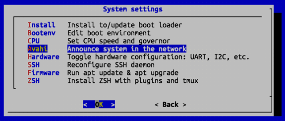
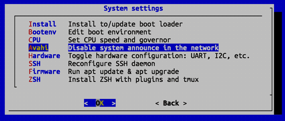

# Kubernetes на Orange Pi 5 Plus под управлением Ubuntu 20.04 (на других Orange Pi, Raspberry Pi и других SBC тоже должно работать)

## Подготовка

### Установим DBus и Avahi (не обязательно)

DBus — система межпроцессного взаимодействия, которая позволяет различным приложениям и службам в системе общаться
друг с другом. DBus часто используется для управления службами, взаимодействия с системными демонами и упрощения
интеграции приложений.

Avahi — это демон и утилиты для работы с mDNS/DNS-SD (Bonjour) и реализация протокола Zeroconf. Avahi тесно
интегрирован с D-Bus и используется для обнаружения устройств и сервисов в локальной сети и предоставляет
автоматическое обнаружение устройств и сервисов в локальной сети. Например, Avahi используется для обнаружения сетевых
принтеров, файловых серверов и других ресурсов без необходимости ручной настройки. Нам avahi понадобится для
обнаружения хостов кластера в локальной сети. 

```shell
sudo apt update
sudo apt install dbus avahi-daemon avahi-utils
```

Запускаем эти сервисы:
```bash
sudo systemctl start dbus
sudo systemctl start avahi-daemon
```

А также включаем автозапуск при загрузке:
```shell
sudo systemctl enable dbus
sudo systemctl enable avahi-daemon
```

#### Возможные проблемы с DBus

При проверке статуса dbus `sudo systemctl status dbus`, случается, выскакивают предупреждения, типа:
```text
Xxx xx xx:xx:xx _xxx-hostname-xxx_ dbus-daemon[909]: Unknown username "whoopsie" in message bus configuration file
```

Это связано с тем, что в конфигурационном файле DBus указаны несуществующий пользователь _whoopsie_. Это системный
пользователь, используемый сервисом Whoopsie, отвечающий за отправку отчётов об ошибках на серверы разработчиков
(Canonical) в системах Ubuntu. Если whoopsie или его конфигурация установлены, но пользователь отсутствует, возникают такие предупреждения.

Я не возражаю против отправки отчётов об ошибках, тем более, что сервис whoopsie у меня не запущен. :) Так что просто
добавлю пользователя _whoopsie_ в систему:
```shell
sudo adduser --system --no-create-home --disabled-login whoopsie
```

Но если внутренний параноик вам шепчет, что это не безопасно, то нужно найти в каких конфигурационных файлах DBus встречается _whoopsie_ `grep -r "whoopsie" /etc/dbus-1/` и закомментировать или удалить соответствующие строки. 

Также, порадовать своего внутреннего параноика, можно отключить отправку отчётов об ошибках в Ubuntu:
```shell
sudo systemctl stop whoopsie
sudo apt-get remove --purge whoopsie
```

После всех упражнений (добавления пользователя _whoopsie_ или, наоборот истребления его, и отключения сервиса
whoopsie) перезагрузим D-Bus:
```shell
sudo systemctl restart dbus
```

Теперь проверкак статуса dbus:
```shell
sudo systemctl status dbus
```

Не должна выдавать предупреждений:
```text
 dbus.service - D-Bus System Message Bus
     Loaded: loaded (/lib/systemd/system/dbus.service; static)
     Active: active (running) since Sat XXXX-XX-XX XX:XX:XX MSK; 1min ago
TriggeredBy: ● dbus.socket
       Docs: man:dbus-daemon(1)
   Main PID: 8437 (dbus-daemon)
      Tasks: 1 (limit: 18675)
     Memory: 616.0K
        CPU: 112ms
     CGroup: /system.slice/dbus.service
             └─8437 @dbus-daemon --system --address=systemd: --nofork --nopidfile --systemd-activation --syslog-only

XXX XX XX:XX:XX _xxx-hostname-xxx_ systemd[1]: Started D-Bus System Message Bus.
```

#### Возможные проблемы с Avahi

При проверке статуса avahi `sudo systemctl status avahi-daemon`, случается, выскакивают предупреждения, типа:
```text
Xxx xx xx:xx:xx _xxx-hostname-xxx_ avahi-daemon[2079]: Failed to parse address 'fe80::1%xxxxxxxx', ignoring.
```

Я не понял как это исправить и почему локальная петля (loopback) для iv6 `fe80::1` -- проблема. Отключение
обслуживания IPv6 для avahi в конфиге `/etc/avahi/avahi-daemon.conf` не помогло. Ставил в нем `use-ipv6=no`,
но предупреждения продолжались. Но, вроде, это не критично, но...

|                                               |
|:----------------------------------------------|
| **СООБЩАЙТЕ, ЕСЛИ ЗНАЕТЕ КАК ЭТО ИСПРАВИТЬ!** |
|                                               |

Пока я нашел следующее решение (по карйне мере у меня сработало, и сработало только если его проделать после всех
предыдущих пунктов по установке `avahi-daemon` вручную). Порядок действий напоминает шаманство:

Запускаем конфигуратор Orange Pi:
```shell
sudo orangepi-config
```

Панель orangepi-config на Orange Pi 5 выглядит так:


Выбираем пункт **'System: System and security settings'** и заходим в панель **'System Settings'**. Выбираем в ней пункт
'**Avahi: Announce system in the network**':



Сервис устанавливается.


Возможно, на панели 'System Setting' вместо пункта 'Avahi: Announce system in the network' будет пункт 'Avahi: Disable
system announcement in the network':



Всё равно выбираем его: сначала отключаем avahi-демон; после возвращаемся в '**System Settings**'; повторно выбираем пункт
'**Avahi: Announce system in the network**' и устанавливаем avahi-демон заново через '**Avahi: Announce system in the
network**'... Всё как у настоящих системщиков -- надо "выйти и зайти".

Покидаем orangepi-config (Back и затем Exit) и перезагружаем Orange Pi:
```shell
sudo reboot
```

После перезагрузки предупреждения о проблемах  loopback для iv6 (`fe80::1`) в avahi должны исчезнуть.
```shell
sudo service avahi-daemon status
```

Все чисто. Магия!

------
## Настройка сети

#### hostname

Настроить имя хоста (hostname) можно командой `hostnamectl`. Например, для узла `opi5plus-1`:
```shell
sudo hostnamectl set-hostname opi5plus-1
```

Или просто отредактировать файл `/etc/hostname`:
```shell 
sudo nano /etc/hostname
```

И внесем в него имя узла (на самом деле заменим, т.к. в файле уже прописано имя хоста). Например, `opi5plus-1`,
`opi5plus-2` и так далее. Сохраняем и закрываем файл.

Изменения вступят в силу после перезагрузки узла. Но чтобы не перезагружать узел, можно применить изменения в `/etc/hostname` сразу:
```shell
sudo service systemd-hostnamed restart
```

Кстати, чтобы временно изменить hostname, можно использовать команду `hostname`. Например для узла `opi5plus-1`:
```shell
sudo hostname opi5plus-1
```

Что бы узнать текущее имя хоста, можно использовать команду `hostname`:
```shell
hostname
```

#### ip

Можно настроить статический IP-адрес для каждого узла кластера (об этом будет отдельная заметка). Но можно
и оставить и автоматическое получение IP-адреса от DHCP-сервера. Для этого надо на зарезервировать IP-адреса для
каждого узла кластера в DHCP-сервере. Резервирование IP-адресов в DHCP-сервере обычно делается по MAC-адресу устройства.

Чтобы узнать MAC- и IP-адреса Orange Pi. На Ubuntu это можно сделать, например, с помощью команды `ifconfig`.
Увидим что-то вроде этого:
```text
...
...

enP4p65s0: flags=4163<UP,BROADCAST,RUNNING,MULTICAST>  mtu 1500
        inet 192.168.1.110  netmask 255.255.255.0  broadcast 192.168.1.255
        inet6 fe80::1e2f:65ff:fe49:3ab0  prefixlen 64  scopeid 0x20<link>
        ether 1c:2f:65:49:3a:b0  txqueuelen 1000  (Ethernet)
        RX packets 656166  bytes 157816045 (157.8 MB)
        RX errors 0  dropped 12472  overruns 0  frame 0
        TX packets 44578  bytes 4805687 (4.8 MB)
        TX errors 0  dropped 0 overruns 0  carrier 0  collisions 0
        
...
```

* MAC-адрес: `ether 1c:2f:65:49:3a:b0`
* IP-адрес: `inet 192.168.1.110`

И кстати, на Orange Pi 5 Plus есть два сетевых интерфейса: `enP4p65s0` и `enP3p49s0` (и, если установлен
WiFi-адаптер PCIe, ещё и третий). Так что стоит зарезервировать в DHCP адреса для всех интерфейсов.

#### DNS

На всякий случай, установим утилиты для работы с DNS (они обычно уже установлены в Ubuntu, но на всякий случай):
```shell
sudo apt install dnsutils
```

В случае с DHCP настройки DNS получены автоматически, при каждой перезагрузке узла конфигурационный файл
`/etc/resolv.conf` будет перезаписываться. Но если у нас статический IP-адрес, то нам надо настроить `/etc/resolv.conf`
вручную. В нем указывается DNS-сервер, к которому обращается узел для преобразования доменных имен в IP-адреса,
а так же указывается домен, к которому принадлежит узел и который будет использоваться по умолчанию для преобразования
коротких доменных имен в полные. 
```shell
sudo nano /etc/resolv.conf
```

В файле, обычно уже прописаны DNS-сервера. Нам остается только добавить доменное имя. Получим что-то типа вот такого:
```text
# Generated by NetworkManager
nameserver 192.168.1.1
nameserver fe80::1%enP4p65s0
search local
```

Как видим мы добавили строку `search local`, где `local` -- это доменное имя которое будет добавляться к коротким,
и таким образом hostname в нашем случае `opi5plus-1` будет преобразовываться в `opi5plus-1.local`. Сохраняем и
закрываем файл.

#### hosts

Что бы узлы кластера могли общаться между собой по именам, нам надо добавить их в файл `/etc/hosts`. Откроем его:
```shell
sudo nano /etc/hosts
```

И добавим в него строки вида для каждого узла кластера. Например, для узлов `opi5plus-1`:
```text
127.0.0.1   localhost
127.0.1.1   opi5plus-1.local    opi5plus-1
::1         localhost ip6-localhost ip6-loopback    opi5plus-1.local opi5plus-1
fe00::0     ip6-localnet
ff00::0     ip6-mcastprefix
ff02::1     ip6-allnodes
ff02::2     ip6-allrouters

# УЗЛЫ КЛАСТЕРА (не забудьте заменить ip-адреса и имена узлов)
192.168.1.XX1    opi5            opi5.local
192.168.1.XX2    opi5plus-1      opi5plus-1.local
192.168.1.XX3    opi5plus-2      opi5plus-2.local
192.168.1.XX4    opi5plus-3      opi5plus-3.local
192.168.1.XX5    rpi3b           rpi3b.local
```

Перезагружаем сетевые настройки:
```shell
sudo service networking restart
```

Теперь узлы кластера могут общаться между собой по именам. Можно проверить, например, пингом:
```shell
ping opi5plus-3
```

## Еще немного подготовительных действий

#### Настойка времени

Посмотреть текущий часовой пояс можно командой:
```shell
timedatectl
```

Установим на всех узлах часовой пояс. Например, для Москвы:
```shell
sudo timedatectl set-timezone Europe/Moscow
```
На Orange Pi 5 настройку часового пояса можно сделать и через `orangepi-config` (пункт **'System: Timezone'**).

Также установим NTP (Network Time Protocol) для синхронизации времени. Описание установки и настройки есть
[в другой заметке](../misc/deploying-django-site-to-dvs-hosting.md#3-настраиваем-службу-времени-необязательно).

Следует отметить, что т.к. у Orange Pi 5 Plus есть встроенные часы реального времени (RTC), а NTP-клиент создает
более высокие накладные расходы по сравнению с SNTP (Simple Network Time Protocol), то для микрокомпьютеров можно
немного поднастроить его. В частности убрать дефолтный список NTP-серверов и добавить только ближайшие к нам.
Список NTP-серверов можно посмотреть на сайте [ntppool.org](https://www.ntppool.org/). Например, для России список
пула в `/etc/ntp.conf` будет такой (и добавим еще московский из описания выше... и не забудьте убрать дефолтные):
```text
pool 0.ru.pool.ntp.org minpoll 9 maxpoll 14
pool 1.ru.pool.ntp.org minpoll 9 maxpoll 14
pool 2.ru.pool.ntp.org minpoll 9 maxpoll 14
pool 3.ru.pool.ntp.org minpoll 9 maxpoll 14
server ntp.msk-ix.ru minpoll 8 maxpoll 12 prefer
```

Здесь:
* `pool` -- Указывает пул серверов времени. Клиент автоматически выбирает серверы из указанного пула и может 
   переключаться между ними для повышения надежности и отказоустойчивости. `server` -- указывает конкретный сервер
   времени для синхронизации. Если сервер недоступен, NTP-клиент будет пытаться подключиться к нему снова
   через некоторое время.
* `minpoll` и `maxpoll` -- это минимальный и максимальный интервалы обращения к серверу. Значения -- это степени
   двойки. По умолчанию значения равны 6 (64 секунды) и 10 (~17 минут). Но для микрокомпьютеров можно установить 
   побольше. У нас 9 (~8.5 минуты) и 14 (~4.5 часа). На самом деле обращения к серверам времени будут происходить
   в случайные интервалы времени (jitter), но в пределах указанных значений.
* `prefer`-- это приоритетный сервер. Если у нас несколько серверов, то NTP-клиент будет обращаться к приоритетному.

Это позволит уменьшить нагрузку от NTP-клиента и снизить трафик.

#### Установка необходимых пакетов

В системе уже должны быть установлены пакеты `apt-transport-https` (для работы с HTTPS-репозиториями) и `curl` (для
передачи и получения данных с использованием различных протоколов), `wget` (для загрузки файлов из интернета), `gnupg`
(для работы с GPG-ключами), `sudo` (для выполнения команд от имени суперпользователя), `iptables` (для настройки
фильтрации пакетов), `tmux` (для работы с несколькими терминалами в одном окне). Проверим их наличие:
```shell
sudo apt install apt-transport-https curl wget gnupg sudo iptables tmux
```

Также установим `keepalived` (для обеспечения высокой доступности, балансировки нагрузки, мониторинга состояния
серверов и автоматического переключения на резервные серверы в случае сбоя) и `haproxy` (балансировщик нагрузки и
прокси-сервер для TCP и HTTP приложений, для распределения трафика между серверами и обеспечения высокой доступности).
```shell
sudo apt install keepalived haproxy
```


## Установим Docker и Kubernetes

#### Ключи и репозитории

Для начала на каждом узле нашего будущего кластера надо установить GPG-ключи репозитория Docker и Kubernetes.
Установка GPG-ключей для Docker подробна описана в [отдельной инструкции](../docker/docker-trusted-gpg.md). Для
Kubernetes ключи устанавливаются похожим образом. Скачиваем GPG-ключ в папку `/etc/apt/trusted.gpg.d/`:
```shell
curl -fsSL https://pkgs.k8s.io/core:/stable:/v1.30/deb/Release.key | sudo gpg --dearmor -o /etc/apt/trusted.gpg.d/kubernetes-apt-keyring.gpg
```

Добавляем репозиторий Kubernetes (с указанием этого GPG-ключа и ARM-платформы, ведь у нас Orange Pi 5 Plus на ARM):
```shell
echo 'deb [arch=arm64 signed-by=/etc/apt/trusted.gpg.d/kubernetes-apt-keyring.gpg] https://pkgs.k8s.io/core:/stable:/v1.30/deb/ /' | sudo tee /etc/apt/sources.list.d/kubernetes.list
```

Готово. Теперь обновим список пакетов:
```shell
sudo apt update
```

#### Модули и параметры ядра

В каждом узле, создадим конфигурационный файл для загрузки необходимых Kubernetes модулей ядра (`overlay` и
`br_netfilter`). Для этого создадим конфиг в папке `/etc/modules-load.d/`. Файл может иметь любое имя с расширением
`.conf`, для удобства назовем его `k8s.conf`:
```shell
sudo nano /etc/modules-load.d/k8s.conf
```

В файле пропишем модули:
```yaml
# Load overlay module (драйвер для работы с файловой системой overlayfs, для объединения
# нескольких файловых систем в одну)
overlay

# Load br_netfilter module (Драйвер для работы с сетевыми мостами и фильтрацией пакетов)
br_netfilter
```

Сохраняем и закрываем файл и теперь, благодаря конфигу, эти модули ядра будут автоматически загружаться при каждой
перезагрузке узла. Но чтобы загрузить сразу и сейчас выполним команды:
```shell
sudo modprobe overlay
sudo modprobe br_netfilter
```

Затем создадим конфигурационный файл для ядра Linux в папке `/etc/sysctl.d/`. В эту папку помещаются файлы с
для настройки параметров ядра Linux. Создадим файл `k8s.conf`:
```shell
sudo nano /etc/sysctl.d/k8s.conf
```

В файле пропишем параметры:
```toml
# Enable IPv6 traffic through iptables on bridges (Разрешаем обработку IPv6-трафика через iptables на сетевых мостах)
net.bridge.bridge-nf-call-ip6tables = 1

# Enable IPv4 traffic through iptables on bridges (Разрешаем обработку IPv4-трафика через iptables на сетевых мостах)
net.bridge.bridge-nf-call-iptables = 1

# Enable IP forwarding (Разрешаем пересылку IP-пакетов для маршрутизации трафика между контейнерами)
net.ipv4.ip_forward = 1
```

В принципе, первые два параметра уже установлены по умолчанию (посмотреть текущие параметры ядра можно командой
`sysctl -a`), но на всякий случай все равно укажем их в файле. Сохраняем и закрываем файл. Теперь при перезагрузке
узла эти параметры будут загружаться автоматически. Но чтобы загрузить их сразу исопльзуем команду:
```shell
sudo sysctl -f /etc/sysctl.d/k8s.conf
```

#### Отключение swap

Для обеспечения стабильной и предсказуемой работы контейнеров, Kubernetes требует отключения файла подкачки (swap).
Это может замедлить работу системы (по этому лучше использовать Orange Pi c большим объемом памяти), но когда включен
swap, ядро может перемещать неактивные страницы памяти на диск, что может привести к задержкам и непредсказуемому
поведению контейнеров. Отключение swap позволяет Kubernetes более точно управлять ресурсами и гарантировать, что
контейнерам будет выделено достаточно памяти.

Проверим, включен ли swap:
```shell
sudo swapon --show
```

Если увидим, что swap включен, например вот так:
```text
NAME       TYPE      SIZE USED PRIO
/dev/zram0 partition 7.8G   0B    5
```

Как видим, у нас есть swap-раздел `/dev/zram0`. Это "электронный диск" в памяти, который используется для
кэширования данных. Отключим его:
```shell
sudo swapoff /dev/zram0
```

Сначала узнать как на самом деле называется служба `zram` в вашей системе можно командой:
```shell
systemctl list-units --type=service | grep zram
```

Затем отключим эту службу чтобы электронный диск не создавался при каждой загрузке:
```shell
sudo systemctl disable  orangepi-zram-config.service
```

И остановим службу:
```shell
sudo service orangepi-zram-config stop 
```

И наконец, удалим соответствующие записи из файла `/etc/fstab`, чтобы предотвратить их автоматическое монтирование при
загрузке системы. Для этого удалим из файла `/etc/fstab` строку, содержащую `/dev/zram0`:
```shell
sudo sed -i '/zram0/d' /etc/fstab
```


