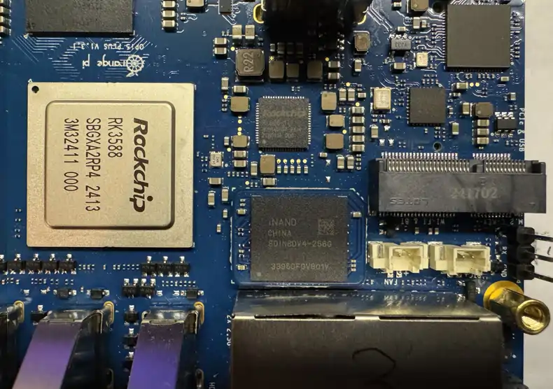
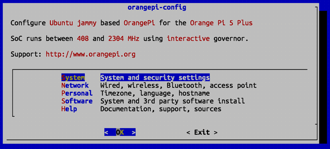
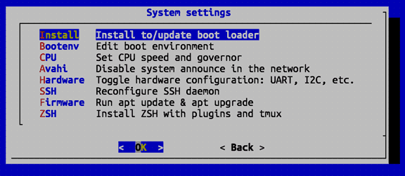
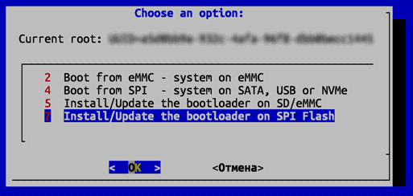
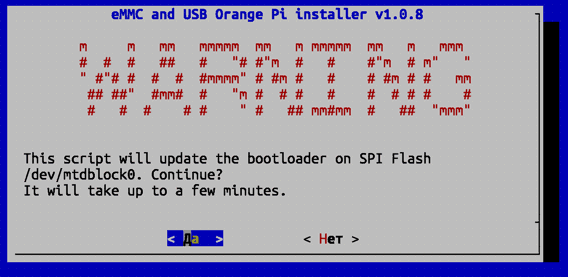

# Orange Pi 5 Plus: перенос системы на eMMC (или M.2 NVMe)

По правде сказать, приведенный ниже рецепт не совсем перенос системы с MicroSD (она же MicroSDHC или MicroSDXC) на
eMMC-носитель или SSD-накопитель NVMe. Это, скорее, установка чистой системы на eMMC или SSD. Но, тем не менее, в
процессе описания будут комментарии, и пояснения, благодаря которым можно будет перенести и уже работающую и
отлаженную систему.

Процедура немного напоминает магию, но это результат глубокого заныривания в интернет, и проверено сработает.

Выключим Orange Pi 5 Plus и установим в него eMMC-носитель и/или SSD-накопитель NVMe.

| Фото до и после установки eMMC. Внимание, устанавливайте до щелчка с обоих сторон! |
|:-----------------------------------------------------------------------------------|
|  |
|     |

После этого включим Orange Pi 5 Plus. И после того как он загрузится, посмотрим какие устройства и тома есть в системе:
```shell
sudo lsblk
```

Увидим что-то подобное:
```text
NAME         MAJ:MIN RM   SIZE RO TYPE MOUNTPOINTS
mtdblock0     31:0    0    16M  0 disk 
mmcblk1      179:0    0  59.7G  0 disk 
├─mmcblk1p1  179:1    0     1G  0 part /boot
└─mmcblk1p2  179:2    0    58G  0 part /var/log.hdd
                                       /
mmcblk0      179:32   0   233G  0 disk 
└─mmcblk0p1  179:33   0 230.6G  0 part 
mmcblk0boot0 179:64   0     4M  1 disk 
mmcblk0boot1 179:96   0     4M  1 disk 
zram0        254:0    0   7.7G  0 disk [SWAP]
zram1        254:1    0   200M  0 disk /var/log
```

Важно обратить внимание на объемы накопителей. В данном случае, у нас есть MicroSD-носитель `mmcblk1` (59.7G — это
64Gb флешка) и eMMC-носитель `mmcblk0` (233G — это 256Gb eMMC). У вас могут быть другие объемы и другие имена
устройств. Так же обратите внимание, ещё у нас есть `mtdblock0` — это внутренняя SPI-флеш, которая
используется для загрузки системы. Если у вас есть SSD-накопитель NVMe, он будет иметь имя вроде `nvme0n1`.

На этом этапе, если мы хотим именно перенести систему, самое время сделать образ нашей MicroSD на внешний
носитель (например, на USB-диск или сетевое хранилище). Смонтируем внешний накопитель, например для сетевого
хранилища c Samba:
```shell
mount -t cifs -o username=NAS_USERNAME,password=SECRET //xxx.xxx.xxx.xxx/путь-к-месту-для-сохранения-образа /media/backup/
```

Где:
- `NAS_USERNAME` — имя пользователя для доступа к сетевому хранилищу;
- `SECRET` — пароль для доступа к сетевому хранилищу;
- `xxx.xxx.xxx.xxx` — IP-адрес сетевого хранилища;
- `путь-к-каталогу-для-сохраненияь-обраа` — путь к каталогу на сетевом хранилище, куда будет сохранен образ;
- `/media/backup/` — точка монтирования сетевого хранилища.
  
Сделаем образ MicroSD в файл `flash-disk.img` на этом внешнем накопителе:
```shell
sudo dd if=/dev/mmcblk1 of=/media/backup/flash-disk.img status=progress
```

Это займет некоторое время (и иногда, в зависимости от скорости внешнего накопителя и размера MicroSD, довольно
продолжительное). После того как образ будет готов, установим в систему `gdisk` — утилиту для работы
с таблицами разделов:
```shell
sudo apt install gdisk
```
## Очистим разделы на SPI-флеш (внутренней флеш-памяти с загрузчиками)

Запустим `gdisk` для работы с заделами на SPI `mtdblock0` (загрузчиками): 

```shell
sudo gdisk /dev/mtdblock0
```

Увидим что-то подобное:
```text
GPT fdisk (gdisk) version 1.0.8

Partition table scan:
  MBR: protective
  BSD: not present
  APM: not present
  GPT: present

Found valid GPT with protective MBR; using GPT.

Command (? for help): 
```

Если введем `?` и нажмем Enter, увидим список команд:
```text
b       back up GPT data to a file
c       change a partition's name
d       delete a partition
i       show detailed information on a partition
l       list known partition types
n       add a new partition
o       create a new empty GUID partition table (GPT)
p       print the partition table
q       quit without saving changes
r       recovery and transformation options (experts only)
s       sort partitions
t       change a partition's type code
v       verify disk
w       write table to disk and exit
x       extra functionality (experts only)
?       print this menu
```

Выполним команду `p` и Enter, чтобы увидеть список разделов:
```text
Disk /dev/mtdblock0: 32768 sectors, 16.0 MiB
Sector size (logical/physical): 512/512 bytes
Disk identifier (GUID): XXXXXXXX-XXXX-XXXX-XXXX-XXXXXXXXXXXX
Partition table holds up to 128 entries
Main partition table begins at sector 2 and ends at sector 33
First usable sector is 34, last usable sector is 8158
Partitions will be aligned on 64-sector boundaries
Total free space is 1021 sectors (510.5 KiB)

Number  Start (sector)    End (sector)  Size       Code  Name
   1              64            1023   480.0 KiB   8300  idbloader
   2            1024            7167   3.0 MiB     8300  uboot

Command (? for help):
```

Как видим, у нас есть два раздела: `idbloader` и `uboot`. Нам нужно удалить их. Для этого выполним команду `d` и Enter.
Увидим:
```text
Partition number (1-2):
```

Введем номер раздела `1` и Enter. Раздел будет удален. Повторим для раздела `2`. Снова выполним команду `d` и Enter.
Теперь нас не спросят номер раздела, оставшийся раздел будет удален без лишних вопросов. Если у вас, вдруг, было
больше двух разделов, надо последовательно удалить их все.

Теперь нам нужно сохранить изменения. Для этого выполним команду `w` и Enter. Увидим:
```text
Warning! Secondary header is placed too early on the disk! Do you want to
correct this problem? (Y/N):
```

Подтверждаем наше намерения перезаписать таблицу разделов. Вводим введя `y` и Enter. Увидим:
```text
Have moved second header and partition table to correct location.

Final checks complete. About to write GPT data. THIS WILL OVERWRITE EXISTING
PARTITIONS!!

Do you want to proceed? (Y/N):
```

Еще раз подтверждаем наше намерение перезаписать таблицу разделов. Вводим `y` и Enter. Увидим:
```text
OK; writing new GUID partition table (GPT) to /dev/mtdblock0.
Warning: The kernel is still using the old partition table.
The new table will be used at the next reboot or after you
run partprobe(8) or kpartx(8)
The operation has completed successfully.
```

## Очистим разделы на целевом eMMC (или SSD NVMe)

Теперь нам нужно очистить разделы на целевом накопителе. Для этого запустим `gdisk` для работы с разделами на eMMC
(в нашем случае это `mmcblk0`):
```shell
sudo gdisk /dev/mmcblk0
```

Проделаем те же операции, что и с SPI-флешем. Не буду повторяться, так как процедура аналогична. Важно помнить, что
нам нужно удалить все(!) разделы.

## Выравняем разделы на eMMC (или SSD NVMe)

Выравнивание секторов eMMC гарантирует правильное распознавание загрузочного диска. Снова запустим `gdisk` для нашего
eMMC:
```shell
sudo gdisk /dev/mmcblk0
```

Дадим команду `p` и Enter, чтобы, чтобы увидеть список разделов, и обратим внимание, на текст над таблицей разделов:
```text
Disk /dev/mmcblk0: 488570880 sectors, 233.0 GiB
Sector size (logical/physical): 512/512 bytes
Disk identifier (GUID): XXXXXXXX-XXXX-XXXX-XXXX-XXXXXXXXXXXX
Partition table holds up to 128 entries
Main partition table begins at sector 2 and ends at sector 33
First usable sector is 2048, last usable sector is 488570846
Partitions will be aligned on 2048-sector boundaries
Total free space is 4974559 sectors (2.4 GiB)
```

В данном случае все нормально: как видим выше, основная таблицы разделов начинается с сектора 2 и заканчивается на 33,
а первый используемый сектор — это любое число, кроме 34 (в нашем случае 2048). Можно пропустить следующие шаги. Но
если у вас нет так, то необходимо переформатировать сектора перед записью новой таблицы разделов на диск.

Для этого выполним следующие шаги:
 
Вводим команду `x` и Enter, чтобы перейти в экспертный режими. В режиме доступны следующие команды:
```text
a       set attributes
b       byte-swap a partition's name
c       change partition GUID
d       display the sector alignment value
e       relocate backup data structures to the end of the disk
f       randomize disk and partition unique GUIDs
g       change disk GUID
h       recompute CHS values in protective/hybrid MBR
i       show detailed information on a partition
j       move the main partition table
l       set the sector alignment value
m       return to main menu
n       create a new protective MBR
o       print protective MBR data
p       print the partition table
q       quit without saving changes
r       recovery and transformation options (experts only)
s       resize partition table
t       transpose two partition table entries
u       replicate partition table on new device
v       verify disk
w       write table to disk and exit
z       zap (destroy) GPT data structures and exit
?       print this menu
```

Переместите основную таблицу разделов. Для этого введите `j` и Enter. Будет предложено задать сектор для расположения
начала основной таблицы разделов:
```text
Currently, main partition table begins at sector 2 and ends at sector 33
Enter new starting location (2 to 61408; default is 2; 1 to abort):
```

Вводим `2` и Enter. Затем сохраняем изменения, выполнив команду `w` и Enter. И пройдя два подтверждения (`y` и Enter)
выходим из `gdisk`.

## Перезаписываем загрузчик

Несколькими попытками проверено, что только такой порядок действий (обновление загрузчика) гарантирует, что
Orange Pi 5 будет загружаться с eMMC. Надо запустить встроенное приложение конфигурации Orange Pi 5:
```shell
sudo orangepi-config
```

Панель orangepi-config на Orange Pi 5 выглядит так:



Выбираем пункт '**System: System and security settings**' и заходим в панель '**System Settings**'. Выбираем в ней
пункт '**Install: Install to/update boot loader**':



Выбираем последний пункт '**Install/Update the bootloader on SPI Flash**':



Подтверждаем наше намерение обновить загрузчик:



Спустя несколько минут мы снова увидим панель '**System Settings**' приложения `orangepi-config`. На этом этапе
можно обновить пакеты системы, выбрав пункт '**Firmware: Run apt update & apt upgrade**'. Но это не обязательно,
можно просто выйти из `orangepi-config`.

Перезагружаем наш Orange Pi 5. Все еще не извлекая MicroSD:
```shell
sudo reboot
```

| Важно! |
|:-------|
| Возможно Orange Pi не загрузится. Просто извлеките MicroSD, перезапишите не неё образ системы (лучше чистой, [с официального сайта производителя](http://www.orangepi.org/html/serviceAndSupport/index.html)), загрузитесь снова и проделайте все вышеперечисленное ещё раз. |

## Записываем образ чистой системы на eMMC

Самый простой, быстрый и проверенный способ -- записать на eMMC образ чистой системы, скаченный с официального сайта.
К слову сказать, образы официальных сборок для Orannge Pi лежать на Goolge Drive, так что самое оптимальное скачать
образ на каком-нибудь другом компьютере и перенести его на Orange Pi с помощью USB-накопителя или NAS.

Записываем файл с образом на eMMC:
```shell
sudo dd bs=1M if=Orangepi5plus_1.0.8_ubuntu_jammy_server_linux6.1.43.img of=/dev/mmcblk0 status=progress
```

Все. Можно выключить Orange Pi 5 Plus:
```shell
sudp shutdown 0
```

Извлекаем MicroSD и включаем Orange Pi 5. Он должен загрузиться с eMMC.

## Перенос системы с MicroSD на eMMC

Если установка чистой системы на eMMC не подходит (наприер, если на MicroSD уже настроена и отлажена система), то
можно перенести систему с MicroSD на eMMC. Правда это не сработает, если размер eMMC меньше размера MicroSD (1), а
если сработает (размер eMMC больше размера MicroSD), то на eMMC, после копирования, будут созданы тома и разделы
ровно такого же размера, как на MicroSD (2).

Копируем разделы с MicroSD на eMMC:
```shell
sudo dd bs=1M if=/dev/mmcblk1 of=/dev/mmcblk0 status=progress
```

Это займет продолжительное время. После того как копирование завершится, выключаем Orange Pi 5:
```shell
sudp shutdown 0
```

Извлекаем MicroSD и включаем Orange Pi 5. Он должен загрузиться с eMMC. Теперь нужно "растянуть" разделы на eMMC
на весь объем накопителя. Для этого читайте отдельную инструкцию.


## PS

В составлении этой заметки большую помощь оказала инструкция [Kaveh Kaviani](
https://github.com/kaveh-kaviani/Tutorials/blob/main/content/sbc/orange-pi/orange-pi-5/boot-linux-from-emmc/README.md).
Большое спасибо ему.
